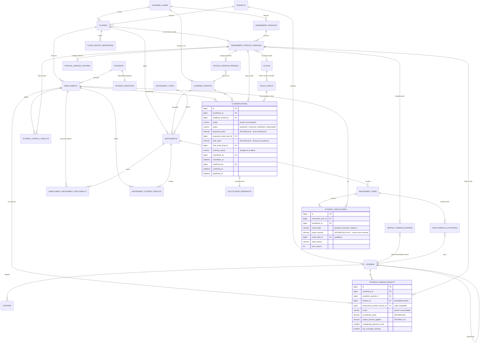

# LÁPIS — Modelo de Domínio da Avaliação

**Estado:** proposta de desenho — *design gate*. Nenhuma migration deve ser escrita antes de este documento ser aprovado.
**Versão:** 0.1 (julho 2026)
**Âmbito:** agregado de avaliação (perfis, instrumentos, grelhas, resultados, propostas, snapshots) + módulos adjacentes exigidos (intervenções, autoavaliação, evidências).
**Base:** `Prompt_base_LAPIS_Claude.md` §9–§15, §21, §24.4, Anexo A; `Estrutura de menus e submenus da aplicação.docx`; mockups de UI (Perfis de Avaliação, Correção Manual, Importar do Intuitivo).

---

## 0. Convenções transversais

Aplicam-se a **todas** as tabelas deste documento, salvo indicação em contrário.

| Convenção | Decisão | Alternativa rejeitada |
|---|---|---|
| Motor | `InnoDB`, `utf8mb4` / `utf8mb4_0900_ai_ci` | `utf8mb3` — não cobre correctamente o português nem emoji em texto livre. |
| Chave primária | `id BIGINT UNSIGNED NOT NULL AUTO_INCREMENT` | ULID como PK — em InnoDB cada índice secundário carrega a PK; 26 bytes x ~45 tabelas x milhões de linhas de scores é custo permanente. |
| Chave exposta | `ulid CHAR(26) CHARACTER SET ascii COLLATE ascii_bin NOT NULL`, `UNIQUE` | UUIDv4 — não ordenável, pior localidade de índice. |
| Tenant | `organization_id BIGINT UNSIGNED NOT NULL` em toda a entidade pertencente a um espaço de trabalho (§21.7) | Base de dados por tenant — inviável no MVP. |
| Índices de tenant | Todo o índice composto de filtragem **começa** por `organization_id`; toda a chave única de negócio **inclui** `organization_id` | Índices sem tenant — permitem colisão de códigos entre organizações. |
| Datas/horas | `DATETIME` (UTC na aplicação), apresentado no timezone da organização (§17.2, §24.4) | `TIMESTAMP` — limite de 2038 e conversão implícita por sessão. Datas civis puras usam `DATE`. |
| Decimais | `DECIMAL` sempre; aritmética em PHP com precisão arbitrária (BCMath). **Nunca FLOAT/DOUBLE** (§24.4) | — |
| Enums | `VARCHAR(32)` + `CHECK` + enum PHP como fonte de verdade | `ENUM` MySQL — reordenar/remover valores obriga a reconstrução da tabela; `CHECK` é alteração de metadados e mantém a portabilidade para PostgreSQL (ver Questão Q5). |
| Autoria | `created_by BIGINT UNSIGNED NULL` para `users(id)` `ON DELETE RESTRICT` | `ON DELETE SET NULL` — perderia rasto de autoria; utilizadores são anonimizados, nunca eliminados fisicamente (§22.5). |
| Eliminação | `RESTRICT` por defeito em tudo o que é pedagógico. `CASCADE` **apenas** dentro de um agregado sem história própria (ver §2.9) | Cascatas amplas — §21.7 proíbe cascatas que apaguem história pedagógica. |
| Soft delete | Apenas onde há requisito explícito (instrumentos, evidências, registos). Resultados e snapshots **não** têm soft delete: anulam-se por estado. | Soft delete universal — polui todos os índices e mascara erros. |
| Concorrência | `lock_version INT UNSIGNED NOT NULL DEFAULT 0` nas tabelas editadas em grelha (§25.2) | Bloqueio pessimista — inviável numa grelha de 24x10 células. |

**Nota sobre NULL em índices únicos (MySQL):** o MySQL considera dois `NULL` como *distintos* num índice `UNIQUE`. Isto condiciona várias decisões abaixo — nunca se usa uma coluna anulável como discriminador dentro de uma chave única.

---
## 1. Mapa de agregados

```text
ACESSO E TENANT
  organizations . users . organization_memberships . schools
      |
      |  organization_id (presente em tudo o que segue)
      v
ESTRUTURA ACADEMICA
  academic_years --< academic_periods
  subjects . classes --< class_teachers
  students --1:1-- student_identities
  classes --< enrollments >-- students
      |
      v
REGRA (versionada, congelada na ativacao)
  scales --< scale_levels
  domains (estavel) . criteria (estavel)
  assessment_profiles --< assessment_profile_versions
        assessment_profile_versions --< profile_version_domains
                                    --< profile_version_criteria
                                    --< profile_version_periods
                                    --< profile_version_coverage_rules
      |
      |  profile_version_id (congelado em cada resultado)
      v
RECOLHA (facto observado)
  instrument_types . instruments --< instrument_items
                     instrument_items --< item_domain_allocations
                     instruments --< student_item_scores
      |
      |  motor de calculo (deterministico, sem UI)
      v
RESULTADO (derivado, materializado, recomputavel)
  instrument_student_results
  student_domain_results    (scope: period | accumulated)
  student_overall_results   (scope: period | accumulated)
      |
      v
DECISAO (humana, imutavel apos confirmacao)
  classifications --1:1-- calculation_snapshots

ACOMPANHAMENTO (paralelo; nunca entra no calculo sem regra explicita)
  evidence_records --< evidence_participants
  interventions --< intervention_reviews
  self_assessment_templates --< self_assessment_questions
  self_assessments --< self_assessment_responses
```

**Quatro camadas, quatro naturezas.** *Regra* é versionada e congelada. *Recolha* é facto observado, editável enquanto o instrumento não fecha. *Resultado* é derivado e recomputável a qualquer momento. *Decisão* é humana e imutável.

A fronteira entre **Resultado** e **Decisão** é o ponto onde o LÁPIS deixa de calcular e o professor assume (§3.3). Nada atravessa essa fronteira sem passar por `classifications`. Esta é a razão pela qual `student_overall_results` e `classifications` são tabelas distintas apesar de terem quase a mesma granularidade: a primeira pode ser destruída e recalculada à vontade, a segunda nunca.

---
## 2. Tabelas

### 2.1 Acesso e tenant (resumo — fora do âmbito deste gate, incluído pelas FK)

| Tabela | Propósito | Notas |
|---|---|---|
| `users` | Autenticação. Já existe (starter kit, PK `BIGINT UNSIGNED`). | Não é *tenant-owned*: um utilizador pode pertencer a N organizações. |
| `organizations` | Espaço de trabalho pessoal ou institucional. `type VARCHAR(16)` CHECK `('personal','institutional')`, `timezone VARCHAR(64) NOT NULL DEFAULT 'Europe/Lisbon'`. | §7.1, §17.2 |
| `organization_memberships` | Ligação `(organization_id, user_id)` + papel. `UNIQUE(organization_id, user_id)`. | §7.3 |
| `schools` | Unidade orgânica dentro da organização. | §21.2 |

### 2.2 Estrutura académica

#### `academic_years`
Ano letivo como entidade explícita (§9.1). **É a fronteira de cálculo:** nenhum cálculo atravessa esta entidade («Os dados de anos anteriores não entram nos cálculos do ano atual»).

| Coluna | Tipo | Null | Notas |
|---|---|---|---|
| `id` | `BIGINT UNSIGNED` | não | PK, auto-increment |
| `ulid` | `CHAR(26)` ascii_bin | não | `UNIQUE` |
| `organization_id` | `BIGINT UNSIGNED` | não | FK `organizations` · `ON DELETE RESTRICT` |
| `label` | `VARCHAR(32)` | não | «2026/2027» |
| `starts_on` | `DATE` | não | |
| `ends_on` | `DATE` | não | |
| `status` | `VARCHAR(16)` | não | CHECK `('draft','active','closed','archived')` |
| `country_code` | `CHAR(2)` ascii | não | `'PT'` — calendários e feriados (§9.1) |
| `region_code` | `VARCHAR(8)` ascii | sim | |
| `closed_at` | `DATETIME` | sim | O encerramento dispara snapshots (§13.6) |
| `closed_by` | `BIGINT UNSIGNED` | sim | FK `users` · `ON DELETE RESTRICT` |
| `created_at`, `updated_at` | `DATETIME` | não | |

`UNIQUE(organization_id, label)` · `INDEX(organization_id, status)`

#### `academic_periods`
Semestres, trimestres, módulos — o modelo **não pode ficar limitado a dois** (§9.2).

| Coluna | Tipo | Null | Notas |
|---|---|---|---|
| `id`, `ulid`, `organization_id` | | não | Convenções §0 |
| `academic_year_id` | `BIGINT UNSIGNED` | não | FK `academic_years` · `ON DELETE RESTRICT` |
| `label` | `VARCHAR(64)` | não | «1.º Semestre» |
| `kind` | `VARCHAR(16)` | não | CHECK `('semester','term','trimester','module','other')` |
| `sequence` | `TINYINT UNSIGNED` | não | Ordem, 1-based |
| `starts_on`, `ends_on` | `DATE` | não | |
| `status` | `VARCHAR(16)` | não | CHECK `('draft','open','closed','archived')` |
| `closed_at`, `closed_by` | `DATETIME`, `BIGINT UNSIGNED` | sim | |

`UNIQUE(academic_year_id, sequence)` · `INDEX(organization_id, academic_year_id, starts_on)`

> **`kind` é rótulo, não regra.** O carácter cumulativo de um período **não** vive aqui — vive em `profile_version_periods.is_cumulative` e em `assessment_profile_versions.accumulated_mode` (§3.2), porque é regra pedagógica e tem de ser versionada com o perfil. Ver Questão **Q4**.

#### `subjects`
Disciplina. `name VARCHAR(120) NOT NULL`, `code VARCHAR(32) NOT NULL`, `UNIQUE(organization_id, code)`.

#### `classes`
Turma (§11.1).

| Coluna | Tipo | Null | Notas |
|---|---|---|---|
| `id`, `ulid`, `organization_id` | | não | |
| `school_id` | `BIGINT UNSIGNED` | sim | FK `schools` · `ON DELETE RESTRICT` |
| `academic_year_id` | `BIGINT UNSIGNED` | não | FK · `ON DELETE RESTRICT` |
| `subject_id` | `BIGINT UNSIGNED` | não | FK · `ON DELETE RESTRICT` |
| `grade_level` | `VARCHAR(16)` | sim | «7.º» |
| `course_code` | `VARCHAR(32)` | sim | |
| `label` | `VARCHAR(64)` | não | «7.º A» |
| `assessment_profile_version_id` | `BIGINT UNSIGNED` | sim | FK `assessment_profile_versions` · `ON DELETE RESTRICT`. Versão **corrente**; o histórico vive nos resultados e em `class_profile_migrations`. |
| `status` | `VARCHAR(16)` | não | CHECK `('preparation','active','closed','archived')` |

`UNIQUE(organization_id, academic_year_id, subject_id, label)` · `INDEX(organization_id, academic_year_id, status)`

#### `class_teachers`
Professores autorizados. `UNIQUE(class_id, user_id)` · `role VARCHAR(16)` CHECK `('owner','co_teacher','observer')`. É a base do princípio «apenas as suas turmas» do menu lateral.

#### `students` (dado pedagógico — pseudónimo)
Separação identidade/pedagogia (§11.2, §22.2). **Esta tabela não contém nome.**

| Coluna | Tipo | Null | Notas |
|---|---|---|---|
| `id`, `ulid`, `organization_id` | | não | |
| `pseudonym_code` | `VARCHAR(16)` ascii | não | Código estável não identificativo («ALU-7F2K»). É o que atravessa a fronteira de IA (§19.3, A6). |
| `created_at`, `updated_at` | `DATETIME` | não | |

`UNIQUE(organization_id, pseudonym_code)`

#### `student_identities` (dado identificativo)
1:1 com `students`. Tabela separada, com Policy própria, pronta para **cifra aplicacional e/ou separação física** (§22.3) sem tocar no agregado de avaliação.

| Coluna | Tipo | Null | Notas |
|---|---|---|---|
| `id` | `BIGINT UNSIGNED` | não | PK |
| `student_id` | `BIGINT UNSIGNED` | não | FK · `ON DELETE RESTRICT` · `UNIQUE` |
| `organization_id` | `BIGINT UNSIGNED` | não | Redundante por desenho: permite Policy de tenant sem `JOIN` a `students`. |
| `display_name` | `VARBINARY(512)` | não | Cifrado ao nível da aplicação (cast `encrypted` do Laravel) |
| `display_name_index` | `CHAR(64)` ascii | sim | *Blind index* (HMAC) para pesquisa exacta (§22.3) |
| `school_number` | `VARBINARY(128)` | sim | Número interno — **nunca** chave primária (§11.2) |
| `birth_date` | `DATE` | sim | Só se justificado |

`INDEX(organization_id, display_name_index)`

> Sem dados de saúde, NEE ou categorias especiais (§11.3). Uma futura `student_support_measures` exige especificação, fundamento e proteção reforçada próprios.

#### `enrollments`
Inscrição do aluno numa turma. **É o eixo de todos os resultados** — nunca se liga um resultado a `student_id` directamente, porque o resultado pertence ao par (aluno, turma) e não ao aluno.

| Coluna | Tipo | Null | Notas |
|---|---|---|---|
| `id`, `ulid`, `organization_id` | | não | |
| `class_id` | `BIGINT UNSIGNED` | não | FK · `ON DELETE RESTRICT` |
| `student_id` | `BIGINT UNSIGNED` | não | FK · `ON DELETE RESTRICT` |
| `class_number` | `SMALLINT UNSIGNED` | sim | Número na pauta |
| `enrolled_on` | `DATE` | não | **Data de entrada. O motor de cálculo depende desta coluna (§11.4, A3).** |
| `left_on` | `DATE` | sim | Data de saída |
| `status` | `VARCHAR(16)` | não | CHECK `('active','transferred_out','left','concluded')` |
| `is_late_entry` | `BOOLEAN` | não | `DEFAULT FALSE`. Marcador **de interface** (§11.4: «a interface identifica o ingresso tardio»). O cálculo usa `enrolled_on`, nunca este campo. |
| `late_entry_note` | `VARCHAR(255)` | sim | |

`UNIQUE(class_id, student_id, enrolled_on)` · `INDEX(organization_id, class_id, status)` · `INDEX(organization_id, student_id)`

> **Porquê `enrolled_on` na chave única:** um aluno pode sair e reentrar na mesma turma. `UNIQUE(class_id, student_id)` bloquearia a reentrada; incluir `left_on` não serviria, porque o MySQL trata `NULL` como distinto e permitiria duas inscrições activas em simultâneo. Ver Questão **Q9**.

---
### 2.3 Escalas

#### `scales`
Escala de classificação: «níveis de 1 a 5, valores de 0 a 20, percentagem ou escala personalizada» (menus §5).

| Coluna | Tipo | Null | Notas |
|---|---|---|---|
| `id`, `ulid` | | não | |
| `organization_id` | `BIGINT UNSIGNED` | sim | `NULL` = escala de sistema, partilhada e não editável. |
| `name` | `VARCHAR(120)` | não | «Escala 1 a 5» |
| `kind` | `VARCHAR(24)` | não | CHECK `('numeric','level','percentage','qualitative','custom')` |
| `min_value` | `DECIMAL(6,3)` | sim | `1.000` |
| `max_value` | `DECIMAL(6,3)` | sim | `5.000` |
| `frozen_at` | `DATETIME` | sim | Preenchido no 1.º uso por uma versão de perfil activa. A partir daí é **imutável** (*copy-on-write*). |
| `derived_from_scale_id` | `BIGINT UNSIGNED` | sim | FK auto-referente · `ON DELETE SET NULL` — rasto da cópia |

`UNIQUE(organization_id, name)` · `INDEX(organization_id, kind)`

> **Decisão:** a escala usa o **mesmo mecanismo de congelamento** dos perfis em vez de ter tabela de versões própria. Rejeitado `scale_versions`: seria um segundo mecanismo de versionamento a manter e testar, para uma entidade que na prática muda uma vez por década. Editar uma escala congelada cria uma escala nova, e a versão de perfil seguinte aponta-lhe; as versões antigas continuam a apontar à escala antiga, intacta.

#### `scale_levels`
Níveis/patamares da escala. **É aqui que vive a conversão numérico para qualitativo** («Nível: Muito Bom», mockup da Correção Manual).

| Coluna | Tipo | Null | Notas |
|---|---|---|---|
| `id` | `BIGINT UNSIGNED` | não | PK |
| `scale_id` | `BIGINT UNSIGNED` | não | FK · **`ON DELETE CASCADE`** — um nível não tem vida fora da escala |
| `code` | `VARCHAR(16)` | não | «5», «MB» |
| `label` | `VARCHAR(64)` | não | «Muito Bom», «Excelente» |
| `sequence` | `TINYINT UNSIGNED` | não | Ordem ascendente |
| `numeric_value` | `DECIMAL(6,3)` | sim | Valor do nível na escala (5.000) |
| `normalized_value` | `DECIMAL(9,6)` | **sim** | Ver nota crítica abaixo |
| `band_min_normalized` | `DECIMAL(9,6)` | sim | Limiar inferior, em % do máximo (inclusive) |
| `band_max_normalized` | `DECIMAL(9,6)` | sim | Limiar superior, em % do máximo (inclusive) |
| `is_negative` | `BOOLEAN` | não | `DEFAULT FALSE` — para relatórios e alertas, nunca para cálculo |

`UNIQUE(scale_id, code)` · `UNIQUE(scale_id, sequence)` · `INDEX(scale_id, band_min_normalized)`

> **Nota crítica — §10.4: «Não convertas automaticamente descritores qualitativos em números sem configuração aprovada».** É por isso que `normalized_value` e as bandas são **anuláveis**. Se um nível não tiver `normalized_value`, um resultado registado nesse nível **não pode entrar em aritmética**: o motor não inventa um número — devolve o resultado como não-calculável e a explicação diz «nível X sem conversão numérica configurada». O mesmo para as bandas: sem `band_min/max` preenchidas não há proposta de nível a partir de uma percentagem, apenas o valor bruto. As bandas da escala 1–5 são exactamente o objeto da Questão **Q1**: não podem ser inventadas.
### 2.4 Conceitos pedagógicos estáveis

#### `domains`
Domínio de avaliação — «Oralidade», «Leitura», «Escrita», «Gramática», «Educação Literária».

| Coluna | Tipo | Null | Notas |
|---|---|---|---|
| `id`, `ulid`, `organization_id` | | não | |
| `subject_id` | `BIGINT UNSIGNED` | sim | FK · `ON DELETE RESTRICT`. `NULL` = transversal à organização. |
| `parent_domain_id` | `BIGINT UNSIGNED` | sim | FK auto-referente · `ON DELETE RESTRICT` — **subdomínios** (§10.1) |
| `name` | `VARCHAR(120)` | não | |
| `code` | `VARCHAR(32)` ascii | não | Estável; usado no mapeamento do Intuitivo (A9) |
| `sequence` | `SMALLINT UNSIGNED` | não | |
| `is_active` | `BOOLEAN` | não | `DEFAULT TRUE` — retira da escolha sem apagar história |

`UNIQUE(organization_id, subject_id, code)` · `INDEX(organization_id, parent_domain_id)`

> **A decisão estrutural mais importante deste documento.** O domínio é **estável e não versionado**; apenas o seu *peso* é versionado (em `profile_version_domains`). «Leitura» é o mesmo conceito em v1 e em v2 do perfil — o que muda é valer 25% ou 30%.
>
> Isto permite que `student_domain_results.domain_id` aponte para a identidade estável e que o ecrã «Evolução por domínio» compare o 1.º e o 2.º semestre **mesmo que o perfil tenha sido versionado a meio do ano**. Se os domínios fossem filhos da versão, cada nova versão criaria «Leituras» diferentes e todos os gráficos de evolução partiam-se no cenário A4. O resultado guarda **as duas** referências: `domain_id` (o quê) e `profile_version_id` (com que regra).

#### `criteria`
Critério dentro de um domínio. Estável, pelo mesmo motivo.
Colunas: `id`, `ulid`, `organization_id`, `domain_id` (FK · `ON DELETE RESTRICT`), `name VARCHAR(160)`, `code VARCHAR(32)`, `description TEXT NULL`, `sequence SMALLINT UNSIGNED`.
`UNIQUE(organization_id, domain_id, code)`

#### `instrument_types`
«Tipos de instrumentos — designações utilizadas pelo professor» (menus §5 e §17). Configurável, nunca *hard-coded* (§12.1).
Colunas: `id`, `ulid`, `organization_id` (`NULL` = tipo de sistema), `name VARCHAR(80)`, `code VARCHAR(32)`, `default_purpose VARCHAR(16)`, `is_active BOOLEAN NOT NULL DEFAULT TRUE`.
`UNIQUE(organization_id, code)`

---

## 3. Perfis de avaliação e versionamento

### 3.1 As três tabelas de topo

#### `assessment_profiles` — identidade estável
O perfil é o **nome do contentor**, não a regra. Não contém pesos, escalas nem fórmulas: se contivesse, editá-lo alteraria silenciosamente o histórico (§10.2).

| Coluna | Tipo | Null | Notas |
|---|---|---|---|
| `id`, `ulid`, `organization_id` | | não | |
| `school_id` | `BIGINT UNSIGNED` | sim | FK · `ON DELETE RESTRICT` |
| `academic_year_id` | `BIGINT UNSIGNED` | não | FK · `ON DELETE RESTRICT`. Mockup: «A alteração das ponderações aplica-se apenas ao ano letivo 2026/2027». |
| `subject_id` | `BIGINT UNSIGNED` | não | FK · `ON DELETE RESTRICT` |
| `grade_level` | `VARCHAR(16)` | sim | «7.º» |
| `name` | `VARCHAR(160)` | não | «Português – 7.º Ano – Escala 1 a 5» |
| `description` | `TEXT` | sim | |
| `current_version_id` | `BIGINT UNSIGNED` | sim | FK `assessment_profile_versions` · `ON DELETE RESTRICT`. Última versão **activa** — atalho de leitura, não fonte de verdade. |
| `is_institutional_template` | `BOOLEAN` | não | `DEFAULT FALSE` — biblioteca institucional (§20) |
| `deleted_at` | `DATETIME` | sim | Soft delete: arquivar não é eliminar (§22.5) |

`UNIQUE(organization_id, academic_year_id, subject_id, grade_level, name)` · `INDEX(organization_id, academic_year_id, subject_id)`
#### `assessment_profile_versions` — a regra congelável
**Toda** a regra de cálculo vive aqui e nos seus filhos. Um resultado aponta para uma linha desta tabela e, com isso, sabe exactamente como foi calculado.

| Coluna | Tipo | Null | Notas |
|---|---|---|---|
| `id`, `ulid`, `organization_id` | | não | |
| `assessment_profile_id` | `BIGINT UNSIGNED` | não | FK · `ON DELETE RESTRICT` |
| `version_number` | `SMALLINT UNSIGNED` | não | 1, 2, 3, ... |
| `status` | `VARCHAR(16)` | não | CHECK `('draft','active','superseded','retired')` |
| `scale_id` | `BIGINT UNSIGNED` | não | FK `scales` · `ON DELETE RESTRICT`. Escala principal. |
| `domain_weight_mode` | `VARCHAR(24)` | não | CHECK `('must_total_100','free')` — §10.3, «salvo modo especial documentado» |
| `period_result_mode` | `VARCHAR(32)` | não | CHECK `('weighted_domain_average','simple_domain_average','weighted_instrument_average')`. Mockup: «Média ponderada por domínio». |
| `accumulated_mode` | `VARCHAR(32)` | não | CHECK `('all_valid_year_elements','weighted_period_average','last_period_only','disabled')`. **Ver Q4.** |
| `absence_mode` | `VARCHAR(32)` | não | CHECK `('exclude_all','zero_all','zero_unjustified_only','exclude_all_warn')`. **Ver Q2 — sem valor por defeito inventado.** |
| `rounding_mode` | `VARCHAR(16)` | não | CHECK `('half_up','half_down','half_even','ceil','floor','none')`. **Ver Q3.** |
| `rounding_scale` | `TINYINT UNSIGNED` | não | Casas decimais do valor final |
| `rounding_stage` | `VARCHAR(16)` | não | CHECK `('final_only','each_domain','each_stage')`. Defeito proposto: `final_only` (§13.3). |
| `minimum_rules` | `JSON` | sim | «mínimos ou condições especiais, **apenas se definidos pelo utilizador**» (§10.1). Ver Q7. |
| `activated_at` | `DATETIME` | sim | **Momento do congelamento.** Obrigatório sempre que o estado não é rascunho. |
| `activated_by` | `BIGINT UNSIGNED` | sim | FK `users` · `ON DELETE RESTRICT` |
| `frozen_at` | `DATETIME` | sim | Igual a `activated_at`; coluna explícita usada pelo guarda de imutabilidade |
| `superseded_at` | `DATETIME` | sim | |
| `superseded_by_version_id` | `BIGINT UNSIGNED` | sim | FK auto-referente · `ON DELETE RESTRICT` — cadeia de versões |
| `change_note` | `VARCHAR(500)` | sim | «Porquê esta versão» — alimenta o «Ver histórico» do mockup |
| `created_from_version_id` | `BIGINT UNSIGNED` | sim | FK auto-referente · `ON DELETE RESTRICT` |

`UNIQUE(assessment_profile_id, version_number)` · `INDEX(organization_id, status)` · `INDEX(assessment_profile_id, status)`
**Só pode existir uma versão activa por perfil — garantido pela base de dados.** O MySQL não tem índices únicos parciais. A solução é uma coluna gerada que só tem valor quando a versão está activa:

```sql
active_flag TINYINT UNSIGNED AS (IF(status = 'active', 1, NULL)) STORED,
UNIQUE KEY uniq_one_active_version (assessment_profile_id, active_flag)
```

Como o MySQL ignora `NULL` em índices únicos, esta chave permite N versões não-activas e no máximo **uma** activa. Rejeitado: validar apenas em PHP — um duplo clique em «Ativar perfil» cria duas versões activas e corrompe todos os cálculos seguintes; §5.4 exige constraints na base de dados e não apenas na interface.

### 3.2 Filhos da versão (a regra congelada)

#### `profile_version_domains` — **onde vivem os pesos**

| Coluna | Tipo | Null | Notas |
|---|---|---|---|
| `id` | `BIGINT UNSIGNED` | não | PK |
| `assessment_profile_version_id` | `BIGINT UNSIGNED` | não | FK · **`ON DELETE CASCADE`** (ver §2.9: só rascunhos são elimináveis) |
| `domain_id` | `BIGINT UNSIGNED` | não | FK `domains` · `ON DELETE RESTRICT` — a identidade estável |
| `weight_percent` | `DECIMAL(7,4)` | não | `25.0000`. Soma = 100 validada na aplicação. |
| `sequence` | `SMALLINT UNSIGNED` | não | Ordem no ecrã |
| `expected_element_count` | `TINYINT UNSIGNED` | sim | §13.4 — «até cinco elementos por domínio/semestre», **nunca hard-coded** |
| `minimum_element_count` | `TINYINT UNSIGNED` | sim | §13.4 |

`UNIQUE(assessment_profile_version_id, domain_id)` · `INDEX(domain_id)`

> A soma dos pesos = 100% não é verificável por `CHECK` (é uma regra multi-linha). Fica numa *Action* transaccional de ativação + teste dedicado. Rejeitado: trigger `AFTER INSERT` — dispararia a meio de uma inserção legítima de vários domínios.

#### `profile_version_periods`
Os períodos aplicáveis à versão **e o modo como cada um agrega**. É aqui que vive «O 2.º semestre é cumulativo».

| Coluna | Tipo | Null | Notas |
|---|---|---|---|
| `id` | `BIGINT UNSIGNED` | não | PK |
| `assessment_profile_version_id` | `BIGINT UNSIGNED` | não | FK · `ON DELETE CASCADE` |
| `academic_period_id` | `BIGINT UNSIGNED` | não | FK · `ON DELETE RESTRICT` |
| `is_cumulative` | `BOOLEAN` | não | `DEFAULT FALSE`. **A frase do mockup, tornada dado.** |
| `period_weight_percent` | `DECIMAL(7,4)` | sim | Só usado quando `accumulated_mode = 'weighted_period_average'` |
| `contributes_to_accumulated` | `BOOLEAN` | não | `DEFAULT TRUE` |

`UNIQUE(assessment_profile_version_id, academic_period_id)`

#### `profile_version_criteria`
Liga critérios estáveis à versão, com peso dentro do domínio.
Colunas: `id`, `assessment_profile_version_id` (FK · `ON DELETE CASCADE`), `criterion_id` (FK · `ON DELETE RESTRICT`), `domain_id` (FK · `ON DELETE RESTRICT`), `weight_percent DECIMAL(7,4) NULL`, `sequence`.
`UNIQUE(assessment_profile_version_id, criterion_id)`

#### `profile_version_instrument_types`
Tipos preferenciais e cobertura esperada por tipo (§13.4).
Colunas: `id`, `assessment_profile_version_id` (FK · `ON DELETE CASCADE`), `instrument_type_id` (FK · `ON DELETE RESTRICT`), `expected_count TINYINT UNSIGNED NULL`, `is_preferred BOOLEAN NOT NULL DEFAULT FALSE`.
Suporta «dois testes globais por semestre» como **configuração**, não como constante.

#### `class_profile_migrations`
Registo explícito da migração de uma turma entre versões (§10.2, A4). Sem esta tabela, a migração seria uma simples alteração de `classes.assessment_profile_version_id` — invisível e não auditável.

| Coluna | Tipo | Null | Notas |
|---|---|---|---|
| `id`, `ulid`, `organization_id` | | não | |
| `class_id` | `BIGINT UNSIGNED` | não | FK · `ON DELETE RESTRICT` |
| `from_version_id` | `BIGINT UNSIGNED` | sim | FK · `ON DELETE RESTRICT` |
| `to_version_id` | `BIGINT UNSIGNED` | não | FK · `ON DELETE RESTRICT` |
| `impact_preview` | `JSON` | não | Pré-visualização apresentada ao professor **antes** de confirmar (§10.2): por aluno, valor antes/depois. Documento imutável. |
| `affected_enrollment_count` | `SMALLINT UNSIGNED` | não | |
| `recalculated_result_count` | `INT UNSIGNED` | não | |
| `confirmed_by` | `BIGINT UNSIGNED` | não | FK `users` · `ON DELETE RESTRICT` |
| `confirmed_at` | `DATETIME` | não | |
| `reason` | `VARCHAR(500)` | não | Obrigatório |

`INDEX(organization_id, class_id, confirmed_at)`
### 3.3 Estratégia de versionamento — decisão e justificação

**O que é congelado na ativação:** a linha de `assessment_profile_versions` (escala, modos de cálculo, regra de arredondamento, `minimum_rules`) e **todas** as suas linhas-filhas: `profile_version_domains` (pesos, cobertura), `profile_version_periods` (incluindo `is_cumulative`), `profile_version_criteria`, `profile_version_instrument_types`. Congela também, indirectamente, a escala referida (via `scales.frozen_at`, §2.3).

**O que NÃO é congelado:** as identidades estáveis — `domains`, `criteria`, `subjects`. Renomear «Gramática» para «Gramática e Sintaxe» corrige a etiqueta em todo o histórico, e isso está correcto: o conceito é o mesmo. Renomear não é alteração de regra e não deve gerar versão.

**Onde vive a cópia congelada:** em **linhas-filhas reais** de `assessment_profile_versions`. Não é uma coluna-snapshot, não é um blob JSON.

**Como um resultado aponta para a versão usada:** cada linha de `instrument_student_results`, `student_domain_results`, `student_overall_results` e `classifications` carrega `assessment_profile_version_id NOT NULL`, FK com `ON DELETE RESTRICT`. Não é possível eliminar uma versão que tenha resultados — a base de dados recusa. Uma linha de resultado é auto-explicativa: sabe o valor, o domínio estável e a regra exacta que o produziu.
**Alternativas rejeitadas:**

| Alternativa | Porquê rejeitada |
|---|---|
| **Blob JSON** com a regra congelada em `assessment_profile_versions.rules_snapshot` | §21.7 proíbe JSON para dados relacionais que precisam de integridade e pesquisa. Os pesos precisam de ambas: «que perfis dão mais de 30% a Escrita?» é uma pergunta real de coordenador, e a FK de `profile_version_domains.domain_id` para `domains` é integridade que o JSON não dá. Obrigaria ainda o motor a desserializar JSON por aluno em vez de fazer `JOIN`. |
| **Colunas-snapshot** (copiar `weight_percent` para a linha de resultado) | Resolve o peso do domínio e mais nada. A regra é um grafo (domínios x critérios x períodos x cobertura), não um escalar. E duplicaria o peso em milhões de linhas. |
| **Versionamento temporal** (`valid_from`/`valid_to` nas linhas de peso) | Toda a query de cálculo passaria a carregar um predicado de data, e um recálculo feito hoje sobre um período de ontem escolheria a regra errada. A versão explícita é um ponteiro; o intervalo temporal é uma inferência. |
| **Event sourcing** do perfil | Custo desproporcionado. A pergunta «que regra estava activa?» deve custar um `BIGINT`. |
| **Domínios como filhos da versão** (sem `domains` estável) | Partiria a comparação entre períodos assim que existisse uma nova versão (ver §2.4). |

**Como o congelamento é imposto:** `frozen_at IS NOT NULL` faz o modelo recusar a escrita (guarda na camada de Action) + teste de regressão dedicado. Rejeitado *trigger* `BEFORE UPDATE` como primeira linha de defesa: um `CHECK` não compara `OLD`/`NEW`, portanto seria mesmo necessário um trigger, mas triggers são invisíveis em code review e difíceis de testar. O guarda aplicacional cobre a intenção; acrescenta-se o trigger apenas perante incidente real.

**Ciclo de vida:** `draft` (editável) → activação **em transacção** (§24.2) → `active` (imutável) → nova edição copia para novo `draft` v(n+1) → activação marca v(n) como `superseded` e preenche `superseded_by_version_id`. Resultados antigos continuam a apontar para v(n) e **não são recalculados** (§10.2: «nunca recalcules o histórico sem confirmação e registo»). O recálculo faz-se por `class_profile_migrations`, explícito e com pré-visualização.

---
## 4. Instrumentos e recolha

### 4.1 `instruments`

| Coluna | Tipo | Null | Notas |
|---|---|---|---|
| `id`, `ulid`, `organization_id` | | não | |
| `class_id` | `BIGINT UNSIGNED` | não | FK · `ON DELETE RESTRICT` |
| `academic_period_id` | `BIGINT UNSIGNED` | não | FK · `ON DELETE RESTRICT` |
| `instrument_type_id` | `BIGINT UNSIGNED` | não | FK · `ON DELETE RESTRICT` |
| `title` | `VARCHAR(200)` | não | «Teste de Compreensão Leitora – 7.º A» |
| `applied_on` | `DATE` | não | **Data. Comparada com `enrollments.enrolled_on` (A3).** |
| `status` | `VARCHAR(16)` | não | CHECK: draft, prepared, in_correction, completed, published, cancelled, archived |
| `counts_toward_classification` | `BOOLEAN` | não | `DEFAULT TRUE`. **Diagnóstico vs Contabilizável.** |
| `purpose` | `VARCHAR(16)` | não | CHECK: diagnostic, formative, summative, other. **Rótulo.** |
| `total_points` | `DECIMAL(8,4)` | sim | `100.0000` |
| `scale_id` | `BIGINT UNSIGNED` | sim | FK · `ON DELETE RESTRICT`. `NULL` = escala do perfil. |
| `weight` | `DECIMAL(7,4)` | sim | Peso **opcional** do instrumento (§12.2) |
| `allow_bonus` | `BOOLEAN` | não | `DEFAULT FALSE` — §12.3: cotações acima do total só com opção explícita |
| `internal_notes` | `TEXT` | sim | |
| `calendar_event_id` | `BIGINT UNSIGNED` | sim | FK · **`ON DELETE SET NULL`** — §17.2: apagar o evento não pode apagar o instrumento |
| `source_import_job_id` | `BIGINT UNSIGNED` | sim | FK · `ON DELETE SET NULL` — proveniência (A9) |
| `cancelled_at` | `DATETIME` | sim | |
| `cancelled_by` | `BIGINT UNSIGNED` | sim | FK `users` · `ON DELETE RESTRICT` |
| `cancellation_reason` | `VARCHAR(255)` | sim | «Avaliações anuladas ou excluídas» |
| `lock_version` | `INT UNSIGNED` | não | `DEFAULT 0` |
| `deleted_at` | `DATETIME` | sim | |

`INDEX(organization_id, class_id, academic_period_id, applied_on)`
`INDEX(organization_id, class_id, status)`
`INDEX(organization_id, class_id, counts_toward_classification, applied_on)` — índice de suporte ao motor de cálculo
> **Os três eixos são independentes — e isso é requisito, não preferência.**
> «A classificação como formativa ou sumativa não altera automaticamente o peso» (menus §6). Logo:
>
> 1. `purpose` — **rótulo pedagógico**. Nunca lido pelo motor de cálculo. Serve para filtrar («Diagnósticos», «Desde o diagnóstico») e para relatórios.
> 2. `counts_toward_classification` — **porta de entrada no cálculo**. É a única coluna que decide se o instrumento entra.
> 3. `weight` — **quanto pesa**. Independente das duas anteriores.
>
> Um instrumento diagnóstico pode manter `counts_toward_classification = TRUE` se o professor assim decidir; um sumativo pode não contar. Rejeitado: derivar `counts_toward_classification` a partir de `purpose` — é exactamente o acoplamento que o documento de menus proíbe.
>
> **Exclusões do cálculo.** O motor ignora o instrumento quando `counts_toward_classification = FALSE` ou quando o estado é `draft` ou `cancelled`. Um instrumento `in_correction` **entra**, com os resultados que já tiver — é o que permite acompanhar a evolução a meio da correção. Os alunos ainda por corrigir ficam `pending` e não contam (nem como zero).

### 4.2 `instrument_items`
Questão, item ou critério. **O item é a única unidade de pontuação do sistema.**

| Coluna | Tipo | Null | Notas |
|---|---|---|---|
| `id`, `ulid` | | não | |
| `organization_id` | `BIGINT UNSIGNED` | não | Desnormalizado para Policy sem `JOIN` |
| `instrument_id` | `BIGINT UNSIGNED` | não | FK · **`ON DELETE CASCADE`** |
| `code` | `VARCHAR(16)` | não | «Q1» |
| `label` | `VARCHAR(500)` | sim | Enunciado breve |
| `sequence` | `SMALLINT UNSIGNED` | não | |
| `points_possible` | `DECIMAL(8,4)` | não | `10.0000` — cotação |
| `scoring_mode` | `VARCHAR(16)` | não | CHECK: points, scale_level |
| `scale_id` | `BIGINT UNSIGNED` | sim | FK · `ON DELETE RESTRICT`. Obrigatória quando `scoring_mode` é `scale_level`. |
| `criterion_id` | `BIGINT UNSIGNED` | sim | FK `criteria` · `ON DELETE RESTRICT` — item que representa um critério |
| `is_bonus` | `BOOLEAN` | não | `DEFAULT FALSE` — não entra no denominador |
| `source_group_label` | `VARCHAR(120)` | sim | **«Grupo de Questões» do Intuitivo** (§12.6, A9) |

`UNIQUE(instrument_id, code)` · `INDEX(organization_id, instrument_id, sequence)`

> **Uma só unidade de pontuação, um só caminho de código.** §12.3 admite avaliar por questão, critério, rubrica, domínio ou combinação. Modelar cada modo com a sua tabela daria quatro caminhos no motor e quatro baterias de testes.
>
> Decisão: **tudo é um item**. Uma observação oral avaliada directamente num domínio é um instrumento com **um** item, `scoring_mode = 'scale_level'` e uma alocação de 100% a esse domínio. Uma rubrica é um item com `criterion_id` preenchido. A interface esconde esta uniformidade — o professor nunca vê a palavra «item» numa observação; o motor vê sempre a mesma estrutura. Rejeitado: tabela `instrument_domain_scores` paralela — duplicaria os estados de resultado e as regras de ausência.
### 4.3 `item_domain_allocations`
**A tabela que satisfaz o cenário A2** (uma questão repartida 60/40 por dois domínios).

| Coluna | Tipo | Null | Notas |
|---|---|---|---|
| `id` | `BIGINT UNSIGNED` | não | PK |
| `instrument_item_id` | `BIGINT UNSIGNED` | não | FK · **`ON DELETE CASCADE`** |
| `domain_id` | `BIGINT UNSIGNED` | não | FK `domains` · `ON DELETE RESTRICT` |
| `allocation_percent` | `DECIMAL(7,4)` | não | `60.0000` / `40.0000`. Soma por item = 100 (§12.3). |

`UNIQUE(instrument_item_id, domain_id)` · `INDEX(domain_id)`

> Um item sem qualquer alocação **não entra em nenhum domínio** — entra apenas no total do instrumento. É legítimo (uma questão de «apresentação» pode não pertencer a domínio nenhum) e o motor sinaliza-o na explicação. A soma = 100% é validada na aplicação: é regra multi-linha, fora do alcance de `CHECK`.
>
> Rejeitado: `instrument_items.domain_id` simples com uma tabela de excepção para os casos repartidos. Dois caminhos de código para a mesma pergunta («que domínios toca este item?»), e o caso repartido — que o A2 exige — seria o caminho menos testado.

### 4.4 `student_item_scores`
**A tabela de maior volume do sistema** (alunos x itens x instrumentos). É aqui que «vazio nunca é zero» tem de ser estrutural.

| Coluna | Tipo | Null | Notas |
|---|---|---|---|
| `id` | `BIGINT UNSIGNED` | não | PK |
| `organization_id` | `BIGINT UNSIGNED` | não | |
| `instrument_id` | `BIGINT UNSIGNED` | não | FK · `ON DELETE RESTRICT`. Desnormalizado (deriva do item) para filtrar a grelha sem `JOIN`. |
| `instrument_item_id` | `BIGINT UNSIGNED` | não | FK · `ON DELETE RESTRICT` |
| `enrollment_id` | `BIGINT UNSIGNED` | não | FK · `ON DELETE RESTRICT` |
| `result_state` | `VARCHAR(32)` | não | CHECK (ver §5). `DEFAULT 'pending'`. **NOT NULL — é sempre explícito.** |
| `points_earned` | `DECIMAL(8,4)` | **sim** | `NULL` sempre que o estado não é `assessed`. **Nunca 0 para significar ausência de valor.** |
| `scale_level_id` | `BIGINT UNSIGNED` | sim | FK `scale_levels` · `ON DELETE RESTRICT`. Usado quando `scoring_mode = 'scale_level'`. |
| `state_reason` | `VARCHAR(255)` | sim | Motivo da ausência/dispensa/anulação |
| `assessed_at` | `DATETIME` | sim | |
| `assessed_by` | `BIGINT UNSIGNED` | sim | FK `users` · `ON DELETE RESTRICT` |
| `lock_version` | `INT UNSIGNED` | não | `DEFAULT 0` — grelha concorrente (§25.2) |
| `created_at`, `updated_at` | `DATETIME` | não | |

`UNIQUE(instrument_item_id, enrollment_id)` — idempotência da importação (A9)
`INDEX(organization_id, instrument_id, enrollment_id)` — carregamento da grelha
`INDEX(enrollment_id, result_state)` — «por corrigir» do painel

**Invariantes impostas por `CHECK`:**

```sql
CHECK (result_state <> 'assessed' OR points_earned IS NOT NULL OR scale_level_id IS NOT NULL)
CHECK (result_state = 'assessed' OR points_earned IS NULL)
```

> A segunda invariante é a tradução literal de «Nunca trates células vazias como zero» (§12.4) para a base de dados: se o estado não for `assessed`, **é fisicamente impossível** existir um número naquela linha. Um bug de aplicação que tente gravar `0` num aluno ausente é recusado pelo MySQL, não descoberto em junho.
>
> **A ausência de linha é significativa e legítima:** equivale a `pending`. A grelha não pré-cria 24 x 10 linhas vazias; as linhas nascem quando o professor escreve. Rejeitado: materializar todas as células na criação do instrumento — 240 linhas por teste sem informação nenhuma, e obrigaria a *backfill* sempre que se acrescenta um aluno ou uma questão.

### 4.5 `enrollment_instrument_applicability`
Excepção **explícita** do professor sobre a aplicabilidade de um instrumento a um aluno (§11.4: «o professor pode justificar exceções»).

| Coluna | Tipo | Null | Notas |
|---|---|---|---|
| `id` | `BIGINT UNSIGNED` | não | PK |
| `organization_id` | `BIGINT UNSIGNED` | não | |
| `enrollment_id` | `BIGINT UNSIGNED` | não | FK · `ON DELETE RESTRICT` |
| `instrument_id` | `BIGINT UNSIGNED` | não | FK · `ON DELETE RESTRICT` |
| `decision` | `VARCHAR(16)` | não | CHECK: include, exclude |
| `reason` | `VARCHAR(500)` | não | **Obrigatório** |
| `decided_by` | `BIGINT UNSIGNED` | não | FK `users` · `ON DELETE RESTRICT` |
| `decided_at` | `DATETIME` | não | |

`UNIQUE(enrollment_id, instrument_id)`

> **Decisão-chave para o A3.** A aplicabilidade por ingresso tardio é **derivada**, não armazenada: o motor compara `instruments.applied_on` com `enrollments.enrolled_on`/`left_on`. Esta tabela existe apenas para **contrariar** o cálculo derivado, e só existe linha quando o professor decidiu algo (por norma, zero linhas).
>
> Rejeitado: materializar um estado `not_applicable_late_entry` em `student_item_scores` para cada item anterior à entrada. Corrigir a data de inscrição (erro de digitação frequente) obrigaria a um *backfill* de milhares de linhas, e um aluno com data errada ficaria com zeros persistidos — exactamente o que o A3 proíbe. Regra derivada corrige-se mudando **uma** data.

---

## 5. Estados de resultado

Enum PHP `ResultState` (fonte de verdade), `VARCHAR(32)` + `CHECK` na base de dados. **Nunca valores mágicos como `-1`** (§12.5).

| Estado (código) | UI (pt-PT) | Numerador | Denominador | Notas |
|---|---|---|---|---|
| `pending` | Por avaliar | não entra | **não entra** | Ausência de dado, não ausência de mérito. Gera aviso de cobertura (§13.4), nunca nota negativa. |
| `assessed` | Avaliado | **valor** | **entra** | O único estado com número. |
| `absent` | Ausente | conforme `absence_mode` | conforme `absence_mode` | **Ver Q2.** O modelo suporta as 4 opções; a regra vem do perfil, versionada. Nunca assumida (§13.3). |
| `absent_justified` | Ausência justificada | conforme `absence_mode` | conforme `absence_mode` | Distinto de `absent` **porque** `zero_unjustified_only` precisa de os separar. |
| `exempt` | Dispensado | não entra | **não entra** | Dispensa formal. Reduz o universo; não penaliza. |
| `not_applicable` | Não aplicável | não entra | **não entra** | §13.3, regra explícita. Ver nota abaixo. |
| `annulled` | Anulado | não entra | **não entra** | Prova anulada. Preserva o registo e o motivo (`state_reason`); o valor original mantém-se visível em auditoria mas fora do cálculo. |
| `under_review` | Em revisão | não entra | **não entra** | Reclamação pendente. Marca o resultado como provisório e **bloqueia a publicação** da classificação do período. |

**«Não aplicável não entra no denominador» (§13.3), concretamente.** O resultado de um domínio é
`SOMA(points_earned dos itens elegíveis) / SOMA(points_possible x allocation_percent dos itens elegíveis)`.
Um item `not_applicable` é retirado **das duas somas**. Não é um zero no numerador: é uma linha que desaparece da fração. Um aluno com uma questão de 10 pontos «não aplicável» num teste de 100 é avaliado sobre 90 — e a explicação do cálculo di-lo por escrito.

**Propagação.** O estado existe em dois níveis: `student_item_scores.result_state` (célula) e `instrument_student_results.result_state` (aluno x instrumento). O segundo é derivado do primeiro, com precedência: `annulled` > `under_review` > `absent*`/`exempt` (se **todos** os itens o forem) > `assessed` (se **algum** item o for) > `pending`. Um aluno ausente ao teste tem um único estado ao nível do instrumento — não obriga a marcar 10 células como ausentes.

---

## 6. Resultados (camada derivada)

Estas três tabelas são **materializações** do motor de cálculo. Podem ser truncadas e reconstruídas a partir de `student_item_scores` + versão do perfil sem perda de informação. Existem por desempenho (§25.1: não recalcular em cada renderização) e para alimentar gráficos de evolução.

### 6.1 `instrument_student_results`

| Coluna | Tipo | Null | Notas |
|---|---|---|---|
| `id` | `BIGINT UNSIGNED` | não | PK |
| `organization_id` | `BIGINT UNSIGNED` | não | |
| `instrument_id` | `BIGINT UNSIGNED` | não | FK · `ON DELETE RESTRICT` |
| `enrollment_id` | `BIGINT UNSIGNED` | não | FK · `ON DELETE RESTRICT` |
| `assessment_profile_version_id` | `BIGINT UNSIGNED` | não | FK · `ON DELETE RESTRICT` — **a regra usada** |
| `result_state` | `VARCHAR(32)` | não | CHECK (§5) |
| `points_earned` | `DECIMAL(9,4)` | sim | Total bruto: `86.0000` |
| `points_possible` | `DECIMAL(9,4)` | sim | Denominador efectivo **após remoção de NA/dispensa**: `90.0000`, não `100` |
| `normalized_value` | `DECIMAL(9,6)` | sim | % do máximo — **unidade canónica interna** |
| `is_applicable` | `BOOLEAN` | não | `FALSE` = fora do universo (ingresso tardio ou exclusão explícita) |
| `exclusion_reason` | `VARCHAR(32)` | sim | CHECK: before_enrollment, after_leaving, teacher_excluded, diagnostic, cancelled_instrument |
| `calculated_at` | `DATETIME` | não | |

`UNIQUE(instrument_id, enrollment_id)` · `INDEX(organization_id, enrollment_id, calculated_at)`

### 6.2 `student_domain_results` e `student_overall_results`

Ambas partilham a mesma espinha: `enrollment_id`, `academic_period_id`, `assessment_profile_version_id`, `scope`, valores e `calculated_at`.

**`student_domain_results`** acrescenta `domain_id` (FK `domains` · `ON DELETE RESTRICT`) e `weight_percent_applied DECIMAL(7,4)` (o peso **efectivamente** aplicado, copiado para a explicação).
`UNIQUE(enrollment_id, academic_period_id, scope, domain_id)`
`INDEX(organization_id, enrollment_id, domain_id, academic_period_id)` — «Evolução por domínio»

**`student_overall_results`** é a combinação ponderada dos domínios.
`UNIQUE(enrollment_id, academic_period_id, scope)`
`INDEX(organization_id, academic_period_id, scope)` — «Distribuição da turma»

Colunas de valor comuns às duas: `normalized_value DECIMAL(9,6) NULL`, `scale_value DECIMAL(6,3) NULL`, `scale_level_id BIGINT UNSIGNED NULL` (FK · `ON DELETE RESTRICT`), `result_state VARCHAR(32) NOT NULL`, `contributing_element_count SMALLINT UNSIGNED NOT NULL`, `expected_element_count SMALLINT UNSIGNED NULL`, `has_coverage_warning BOOLEAN NOT NULL DEFAULT FALSE` (§13.4: falta de elementos gera **aviso**, nunca nota negativa).

### 6.3 `scope` — «Resultado do período» vs «Resultado acumulado»

`scope VARCHAR(16) NOT NULL` CHECK: `period`, `accumulated`.

- `scope = 'period'` — «Por período: resultado isolado de cada período». Só entram elementos **daquele** período.
- `scope = 'accumulated'` — «Resultado acumulado: resultado obtido com todos os elementos válidos do ano», **até e incluindo** o período da linha.

São **duas linhas distintas** para o mesmo aluno e período, não dois campos na mesma linha. O 2.º semestre tem simultaneamente um resultado isolado (útil para «Comparação entre períodos») e um resultado cumulativo (a classificação que conta), e ambos precisam de valor, nível, contagem de elementos e aviso de cobertura próprios.

> **O acumulado não é a média dos períodos.** Com `accumulated_mode = 'all_valid_year_elements'`, o motor **reprocessa os elementos brutos do ano inteiro** — vai a `student_item_scores`, não a `student_overall_results` do período anterior. É a leitura literal do mockup: «A classificação do 2.º semestre resulta de todas as aprendizagens do ano letivo (1.º e 2.º semestre)». Um aluno com 3 elementos no P1 e 7 no P2 obtém um acumulado ponderado pelos **10 elementos**, não a média de duas médias — que daria peso desproporcionado aos 3 primeiros.
>
> As restantes opções de `accumulated_mode` continuam suportadas pela mesma estrutura (só muda o *input* do motor), porque **isto não pode ser hard-coded**. Ver Q4.

> **Porquê duas tabelas e não uma com `domain_id` anulável.** No MySQL, `UNIQUE(enrollment_id, academic_period_id, scope, domain_id)` com `domain_id = NULL` para a linha global **não impediria duplicados**: o MySQL trata cada `NULL` como distinto, e dois recálculos concorrentes criariam duas linhas globais para o mesmo aluno. A separação em duas tabelas dá chaves únicas totalmente não-anuláveis nas duas. Custo: uma tabela extra. Benefício: impossível ter dois resultados globais do mesmo período.

---

## 7. Decisão: propostas, confirmação e override

### 7.1 `classifications`
Proposta, confirmação, publicação e **alteração manual** numa só linha, porque são estados sucessivos da mesma decisão sobre o mesmo (aluno, período). Rejeitado: `grading_proposals` + `confirmed_classifications` separadas — obrigaria a um `JOIN` para responder à pergunta mais frequente do sistema («que nota tem este aluno?») e criaria o risco de proposta confirmada sem par.

| Coluna | Tipo | Null | Notas |
|---|---|---|---|
| `id`, `ulid`, `organization_id` | | não | |
| `enrollment_id` | `BIGINT UNSIGNED` | não | FK · `ON DELETE RESTRICT` |
| `academic_period_id` | `BIGINT UNSIGNED` | não | FK · `ON DELETE RESTRICT` |
| `scope` | `VARCHAR(16)` | não | CHECK: period, accumulated |
| `assessment_profile_version_id` | `BIGINT UNSIGNED` | não | FK · `ON DELETE RESTRICT` |
| `calculation_snapshot_id` | `BIGINT UNSIGNED` | sim | FK · `ON DELETE RESTRICT` — preenchido na confirmação |
| `status` | `VARCHAR(16)` | não | CHECK: proposed, confirmed, published, superseded |
| `proposed_normalized_value` | `DECIMAL(9,6)` | sim | Valor bruto antes do arredondamento |
| `proposed_value` | `DECIMAL(6,3)` | sim | **Proposta determinística, após arredondamento** |
| `proposed_scale_level_id` | `BIGINT UNSIGNED` | sim | FK `scale_levels` · `ON DELETE RESTRICT`. A10: «nível 3» |
| `final_value` | `DECIMAL(6,3)` | sim | **Valor do professor** |
| `final_scale_level_id` | `BIGINT UNSIGNED` | sim | FK · `ON DELETE RESTRICT`. A10: «nível 4» |
| `override_reason` | `VARCHAR(1000)` | sim | **Obrigatório quando difere** (ver CHECK) |
| `overridden_by` | `BIGINT UNSIGNED` | sim | FK `users` · `ON DELETE RESTRICT` |
| `overridden_at` | `DATETIME` | sim | |
| `confirmed_by` | `BIGINT UNSIGNED` | sim | FK `users` · `ON DELETE RESTRICT` |
| `confirmed_at` | `DATETIME` | sim | |
| `published_at` | `DATETIME` | sim | Comunicada (§13.2) |
| `superseded_by_id` | `BIGINT UNSIGNED` | sim | FK auto-referente · `ON DELETE RESTRICT` |
| `lock_version` | `INT UNSIGNED` | não | `DEFAULT 0` |

`UNIQUE(enrollment_id, academic_period_id, scope, status_active_flag)` — ver nota
`INDEX(organization_id, academic_period_id, status)`

**A invariante do cenário A10, na base de dados:**

```sql
CHECK (
  (final_value IS NULL AND final_scale_level_id IS NULL)
  OR override_reason IS NOT NULL
  OR (final_value <=> proposed_value AND final_scale_level_id <=> proposed_scale_level_id)
)
CHECK (status <> 'confirmed' OR confirmed_by IS NOT NULL)
```

> O operador `<=>` (*null-safe equal*) do MySQL é essencial: com `=` normal, uma comparação envolvendo `NULL` devolve `NULL`, o `CHECK` não falharia e uma alteração manual passaria **sem motivo**. Com `<=>`, alterar a proposta sem escrever motivo é recusado pela base de dados — não pelo formulário.
>
> **A primeira cláusula admite o estado `proposed`.** Uma proposta ainda por decidir tem `final_*` a `NULL` mas `proposed_value` preenchido; sem esta cláusula o `CHECK` rejeitaria a própria inserção da proposta, porque `NULL <=> 80` é falso. «Sem decisão final» significa **ambas** as colunas `final_*` nulas; assim que uma é preenchida, a regra A10 volta a aplicar-se. (A versão inicial deste documento omitia esta cláusula — corrigido na implementação do slice §7, confirmado por CHECK real em MySQL.)
>
> **A10 preserva os quatro elementos por construção:** proposta original (`proposed_value`/`proposed_scale_level_id`, nunca sobrescritos), valor final (`final_*`), motivo (`override_reason`), autor e data (`overridden_by`/`overridden_at`). O `calculation_snapshot_id` garante ainda que se sabe **como** se chegou ao nível 3 que o professor recusou.
>
> **Uma só classificação viva.** Mesmo padrão de coluna gerada de §3.1: `status_active_flag TINYINT AS (CASE WHEN status <> 'superseded' THEN 1 ELSE NULL END) STORED`, permitindo N linhas `superseded` no histórico e no máximo uma viva por (aluno, período, âmbito). (`CASE` em vez de `IF()` para a coluna gerada funcionar igual em MySQL e no SQLite dos testes.)

### 7.2 `calculation_snapshots`
§13.6: ao confirmar uma proposta ou encerrar um período, preservar **inputs + versão das regras + resultado + data + autor**.

| Coluna | Tipo | Null | Notas |
|---|---|---|---|
| `id`, `ulid`, `organization_id` | | não | |
| `enrollment_id` | `BIGINT UNSIGNED` | não | FK · `ON DELETE RESTRICT` |
| `academic_period_id` | `BIGINT UNSIGNED` | não | FK · `ON DELETE RESTRICT` |
| `scope` | `VARCHAR(16)` | não | CHECK: period, accumulated |
| `assessment_profile_version_id` | `BIGINT UNSIGNED` | não | FK · `ON DELETE RESTRICT` |
| `trigger` | `VARCHAR(24)` | não | CHECK: proposal_confirmed, period_closed, year_closed, profile_migration |
| `engine_version` | `VARCHAR(16)` | não | Versão do motor de cálculo — um snapshot de 2026 deve continuar explicável em 2029 |
| `payload` | `JSON` | não | **Documento imutável** (ver abaixo) |
| `payload_hash` | `CHAR(64)` ascii | não | SHA-256 — deteta adulteração e permite detectar recálculo sem alteração |
| `result_normalized_value` | `DECIMAL(9,6)` | sim | Extraído para coluna: permite comparar sem abrir o JSON |
| `result_value` | `DECIMAL(6,3)` | sim | |
| `result_scale_level_id` | `BIGINT UNSIGNED` | sim | FK · `ON DELETE RESTRICT` |
| `created_by` | `BIGINT UNSIGNED` | não | FK `users` · `ON DELETE RESTRICT` |
| `created_at` | `DATETIME` | não | Sem `updated_at`: **nunca** é actualizado |

`INDEX(organization_id, enrollment_id, academic_period_id, created_at)` · `INDEX(assessment_profile_version_id)`

> **Porquê JSON aqui, se §21.7 desaconselha JSON.** Porque §21.7 permite-o para «configurações verdadeiramente flexíveis e versionadas» — e um snapshot é o caso extremo: um documento **congelado**, escrito uma vez e nunca pesquisado por conteúdo interno.
>
> O argumento decisivo é o inverso do habitual: um snapshot relacional seria **pior**, porque as FK continuariam vivas. Se o snapshot apontasse por FK para as linhas de `student_item_scores` que usou, uma correção posterior de uma nota mudaria retroactivamente aquilo que o snapshot diz ter acontecido — deixaria de ser um registo do passado. O snapshot tem de guardar **cópias literais dos valores**, não referências. É, por definição, desnormalizado e imutável: exactamente o que um documento JSON é.
>
> Estrutura de `payload` (contrato versionado por `engine_version`), correspondendo a §13.5: perfil e versão; período e âmbito; lista de instrumentos incluídos (id, título, data, valor, peso); lista de instrumentos **excluídos com motivo**; resultados por domínio com pesos aplicados; valor bruto; regra de arredondamento aplicada; valor proposto; avisos de cobertura.
>
> As colunas escalares (`result_*`, `payload_hash`) são extraídas para fora do JSON porque **são** pesquisadas — a pré-visualização de impacto da migração de perfil (A4) compara valores antigos e novos em massa e não pode desserializar JSON por aluno.

---

## 8. Diagrama ER — agregado central de avaliação



---

## 9. Pipeline de cálculo e precisão decimal

**Unidade canónica interna: percentagem do máximo, `DECIMAL(9,6)`** (`0.000000` a `100.000000`). Tudo é normalizado para esta unidade à entrada e convertido para a escala do professor **apenas no fim**. Rejeitado: calcular na escala nativa de cada instrumento — obrigaria a converter entre 0–20, 0–100 e 1–5 no meio do somatório, multiplicando os pontos de arredondamento.

| # | Fase | Onde vive | Tipo | Arredondamento |
|---|---|---|---|---|
| 1 | **Valor original** | `student_item_scores.points_earned` | `DECIMAL(8,4)` | **Nenhum.** Tal como introduzido (§10.4: «Preserva sempre o valor original»). |
| 1b | Valor original qualitativo | `student_item_scores.scale_level_id` | FK | N/A. Só entra em aritmética se `scale_levels.normalized_value` existir. |
| 2 | **Valor normalizado** | derivado (não persistido ao nível do item) | `DECIMAL(9,6)` | **Proibido.** `points_earned / points_possible x 100`, calculado em BCMath com escala 10 e truncado a 6 casas ao persistir. |
| 3 | **Resultado do instrumento** | `instrument_student_results.normalized_value` | `DECIMAL(9,6)` | **Proibido.** `points_possible` já exclui itens NA/dispensados. |
| 4 | **Resultado por domínio** | `student_domain_results.normalized_value` | `DECIMAL(9,6)` | **Proibido** (excepto `rounding_stage = 'each_domain'`, se o PO o exigir). Pondera por `allocation_percent` e pelo peso do instrumento. |
| 5 | **Resultado do período** | `student_overall_results` (`scope='period'`) | `DECIMAL(9,6)` | **Proibido.** Combina domínios por `profile_version_domains.weight_percent`. |
| 6 | **Resultado acumulado** | `student_overall_results` (`scope='accumulated'`) | `DECIMAL(9,6)` | **Proibido.** Reprocessa os elementos brutos do ano (§6.3). **Nunca parte do valor da fase 5** — parte da fase 1. |
| 7 | **Proposta** | `classifications.proposed_normalized_value` → `proposed_value` | `DECIMAL(9,6)` → `DECIMAL(6,3)` | **O ÚNICO ponto de arredondamento**, com `rounding_mode` + `rounding_scale` da versão do perfil. Conversão para a escala e atribuição de `proposed_scale_level_id` pelas bandas. |
| 8 | **Confirmada** | `classifications.final_value` | `DECIMAL(6,3)` | Nenhum. Decisão humana; se difere, exige motivo. |
| 9 | **Publicada** | `classifications.published_at` | — | Nenhum. Publicar não recalcula nada. |

**Regras de precisão inegociáveis:**

1. **Nunca `FLOAT`/`DOUBLE`** (§24.4). Nem em colunas, nem em variáveis PHP intermédias, nem em `SUM()` de SQL sobre colunas float. Toda a aritmética em BCMath sobre strings.
2. **Um só arredondamento** (§13.3: «o arredondamento só ocorre na fase definida»). Entre as fases 1 e 7 não há perda de precisão além do truncamento a 6 casas na persistência — bem abaixo de qualquer limiar pedagógico.
3. **A regra é versionada** (§13.3): `rounding_mode`, `rounding_scale` e `rounding_stage` são colunas de `assessment_profile_versions`, congeladas na ativação. Alterar o arredondamento é uma nova versão do perfil, com pré-visualização de impacto — não é uma preferência de interface.
4. **`rounding_stage`** existe para o caso de o PO exigir arredondamento por domínio (prática de algumas escolas). O motor suporta; o defeito proposto é `final_only`. Ver **Q3**.
5. **Divisão por zero é um estado, não um erro.** Denominador zero (todos os elementos NA/pendentes/ausentes excluídos) produz `normalized_value = NULL` e `result_state = 'pending'`, com aviso de cobertura. **Nunca produz `0`.** É o A3 no seu limite: um aluno que entrou na última semana não tem elementos aplicáveis e o resultado é «sem elementos», não «zero».

**Escolha das larguras.** `DECIMAL(8,4)` para pontos suporta cotações até 9999.9999 (uma cotação de 1000 pontos com 4 casas é folga confortável). `DECIMAL(9,6)` para percentagens dá 6 casas em 0–100 — a diferença entre dois alunos nunca é decidida no 7.º decimal. `DECIMAL(7,4)` para pesos permite `100.0000` e repartições finas (`33.3333`). `DECIMAL(6,3)` para o valor de escala cobre 0–20, 0–100 e 1–5 com margem (999.999). `DECIMAL(9,4)` nos totais de instrumento absorve a soma de muitos itens.

---

## 10. Módulos adjacentes

### 10.1 Intervenções
Módulo completo do menu lateral (§11 dos menus), **ausente do §21 do prompt-base**. Modelado aqui.

**Uma intervenção é o que o professor FEZ**, intencionalmente, em resposta a uma necessidade, dificuldade, objetivo ou contexto. É isso que a separa de um `evidence_record` (§10.2), que é o que o professor **OBSERVOU**. Um contacto com o encarregado de educação é um registo, não uma intervenção — vive em `EvidenceKind::Contact` e não é duplicado aqui.

**2026-08-14 — módulo alargado.** Deixou de ser «uma medida de apoio, para um aluno, com duração» e passou a «uma ação pedagógica que pode ser pontual ou continuada, para um aluno, um grupo ou uma turma, opcionalmente enquadrada e opcionalmente apreciada». A ampliação é aditiva: nada do modelo anterior foi removido.

#### `interventions`

| Coluna | Tipo | Null | Notas |
|---|---|---|---|
| `id`, `ulid`, `organization_id` | | não | |
| `class_id` | `BIGINT UNSIGNED` | não | FK · `ON DELETE RESTRICT`. Toda a intervenção pertence a uma turma, mesmo quando não nomeia alunos. |
| `enrollment_id` | `BIGINT UNSIGNED` | **sim** | FK · `ON DELETE RESTRICT`. **Legado**, mantida e preenchida só no caso `target_type = student`. A fonte canónica dos participantes é `intervention_enrollment`. |
| `academic_period_id` | `BIGINT UNSIGNED` | sim | FK · `ON DELETE RESTRICT` |
| `domain_id` | `BIGINT UNSIGNED` | sim | FK · `ON DELETE RESTRICT`. Só preenchida quando `domain_relation = specific`. |
| `target_type` | `VARCHAR(16)` | não | CHECK: student, group, class · `DEFAULT 'student'` |
| `intervention_type` | `VARCHAR(64)` | sim | Código estável de `InterventionType`. Nulo apenas nas linhas anteriores ao catálogo, que têm `title` livre. |
| `domain_relation` | `VARCHAR(16)` | não | CHECK: none, specific, all · `DEFAULT 'none'` |
| `title` | `VARCHAR(200)` | não | Preenchido com o label do tipo — o professor nunca escreve um título (§3.1). |
| `description` | `TEXT` | sim | Detalhe opcional; obrigatório só no tipo «Outro». |
| `description_source` | `VARCHAR(16)` | não | CHECK: manual, template, ai · `DEFAULT 'manual'`. Hoje escreve-se sempre `manual`. |
| `status` | `VARCHAR(16)` | não | CHECK: new, in_progress, concluded, cancelled. **Opcional no registo rápido** — uma intervenção pontual fica em `new` e nunca mais é tocada. |
| `started_on` | `DATE` | não | A data da intervenção. Apresentada na UI apenas como «Data». |
| `expected_end_on` | `DATE` | sim | Só faz sentido numa intervenção continuada. |
| `concluded_on` | `DATE` | sim | Carimbada ao concluir. |
| `include_in_report` | `BOOLEAN` | não | **Legado/deprecated.** Mantida e escrita em espelho de `available_for_reports` para não partir leitores antigos. Não usar em código novo; remover só depois de validação em produção. |
| `available_for_reports` | `BOOLEAN` | não | `DEFAULT TRUE`. **Elegibilidade**, não inclusão: nada copia texto para um relatório. |
| `support_measure_level` | `VARCHAR(16)` | sim | CHECK: universal, selective, additional |
| `support_measure_code` | `VARCHAR(64)` | sim | Medida concreta; o seu nível deriva de `SupportMeasureCode::level()` e nunca discorda da coluna acima. |
| `evaluation_adaptation_code` | `VARCHAR(64)` | sim | Adaptação ao processo de avaliação. **Nunca acompanhada de um nível de medida.** |
| `legal_mapping_source` | `VARCHAR(32)` | sim | CHECK: system_direct, system_suggested_confirmed, manual. **Não nulo ⇒ houve decisão.** |
| `created_by` | `BIGINT UNSIGNED` | não | FK `users` · `ON DELETE RESTRICT` |
| `deleted_at` | `DATETIME` | sim | |

`INDEX(organization_id, enrollment_id, status)` · `INDEX(organization_id, status, started_on)` · `INDEX(organization_id, class_id, started_on)`

#### `intervention_enrollment`
Pivot puro — a organização alcança-se pela intervenção, por isso sem `organization_id` (mesma convenção de `class_teachers`). É a **fonte canónica dos participantes**.

| Coluna | Tipo | Null | Notas |
|---|---|---|---|
| `id` | | não | |
| `intervention_id` | `BIGINT UNSIGNED` | não | FK · **`ON DELETE CASCADE`** |
| `enrollment_id` | `BIGINT UNSIGNED` | não | FK · `ON DELETE RESTRICT` |

`UNIQUE(intervention_id, enrollment_id)`

Cardinalidade imposta em `InterventionTargetType::acceptsParticipantCount()`: `student` → exatamente 1 · `group` → 2 ou mais · `class` → **0**. Uma intervenção de turma não lista os alunos de propósito: a turma é o alvo, e nomear cada inscrição envelheceria mal assim que um aluno entrasse ou saísse. O scope `forEnrollment()` compensa isso, devolvendo também as intervenções de turma ao filtrar por um aluno.

#### Catálogo, contexto e enquadramento

`InterventionType` é a **única fonte de verdade** do módulo: label, contexto e enquadramento legal saem todos de lá.

- **O contexto não é persistido.** Deriva de `InterventionType::context()`, tal como `EvidenceKind::group()` deriva o agrupamento dos Registos. O que a base de dados guarda é o **código do tipo**, que é estável: mudar um label é seguro, mudar ou reutilizar um código reescreve o significado de todas as intervenções já registadas.
- Nenhum `match()` do catálogo tem `default`. Acrescentar um tipo sem decidir contexto e enquadramento **falha nos testes** em vez de cair silenciosamente em «aprendizagem» ou «sem enquadramento».
- **Contexto ≠ domínio.** Domínio é pedagógico e da disciplina (Leitura, Escrita…); contexto é transversal (avaliação, comportamento…). Não existem domínios falsos como «Transversal» ou «Comportamento».

Quatro modos de mapeamento (`LegalMappingMode`):

| Modo | O que a app faz | Origem gravada |
|---|---|---|
| `direct` | Preenche sozinha — o tipo **é** a medida | `system_direct` |
| `contextual` | **Sugere**; só grava se o professor confirmar | `system_suggested_confirmed` |
| `evaluation_only` | Grava a adaptação, **sem nível de medida** | `system_direct` |
| `none` | Nada | `null` (ou `manual`, se o professor definir) |

> **Uma sugestão por confirmar não é gravada de todo.** Não há estado «sugerido mas pendente»: ou o professor confirmou e existe uma decisão, ou não existe nada. Isto garante que nenhuma query futura possa ler uma sugestão como se fosse uma decisão legal.

**Estratégia corrente ≠ medida formal.** O catálogo distingue deliberadamente as duas coisas, mesmo quando o nome corrente se parece com o da medida:

| Estratégia pedagógica corrente (`none`) | Medida formal correspondente (`direct`) |
|---|---|
| Apoio individualizado | Apoio psicopedagógico · Apoio tutorial (seletivas) |
| Promoção da autonomia | Desenvolvimento de competências de autonomia pessoal e social (adicional) |

As primeiras são prática de todos os dias e não propõem enquadramento nenhum — o seu sentido corrente é muito mais largo do que qualquer medida do DL 54/2018, e equipará-las automaticamente seria pôr palavras na boca do professor. As segundas existem como tipos próprios, escolhidos deliberadamente, e essas sim trazem enquadramento direto. Nenhuma substitui a outra: coexistem no catálogo.

O mesmo cuidado separa apoio pedagógico de adaptação na avaliação, onde a língua corrente os aproxima: **«Apoio à interpretação de enunciados»** é ensino (contexto `learning`, sem enquadramento), enquanto **«Leitura de enunciados em situação de avaliação»** é uma adaptação (contexto `evaluation`, `evaluation_only`). O rótulo do segundo é deliberadamente explícito; o seu código continua `statement_reading`, porque a história está ancorada ao código e nunca à redação.

#### `EvaluationAdaptationCode`
Dez adaptações **operacionais**. Nenhuma implica medida universal, seletiva ou adicional — `support_measure_level` permanece nulo salvo escolha manual do professor.

`statement_reading` · `test_reading` · `instruction_comprehension_support` · `simplified_wording` · `response_format_adaptation` · `instrument_adaptation` · `extra_time` · `separate_room` · `direct_answer_questions` · `other`

Acrescentar códigos aqui **não exige migration**: a coluna é `VARCHAR(64)` sem CHECK constraint, deliberadamente, porque este catálogo é operacional e cresce com a prática — ao contrário de `support_measure_level` e `legal_mapping_source`, que são fechados e têm CHECK.

> **Enquadrar a ação ≠ classificar o aluno.** Registar uma intervenção que se enquadra numa medida seletiva **não** significa que o aluno está formalmente abrangido por medidas seletivas. A app pode automatizar a primeira leitura; a segunda é um facto administrativo que nunca infere. Do mesmo modo, dar tempo suplementar a um aluno não diz nada sobre o seu estatuto — por isso `evaluation_adaptation_code` nunca vem acompanhado de `support_measure_level`.

#### `intervention_reviews`
«Avaliação da intervenção — apreciação da evolução ou eficácia». Tabela-filha porque uma intervenção longa é apreciada várias vezes; uma coluna só guardaria a última.

| Coluna | Tipo | Null | Notas |
|---|---|---|---|
| `id`, `ulid`, `organization_id` | | não | |
| `intervention_id` | `BIGINT UNSIGNED` | não | FK · **`ON DELETE CASCADE`** |
| `reviewed_on` | `DATE` | não | |
| `effectiveness` | `VARCHAR(24)` | sim | CHECK: not_effective, partially_effective, effective, inconclusive |
| `notes` | `TEXT` | sim | |
| `reviewed_by` | `BIGINT UNSIGNED` | não | FK `users` · `ON DELETE RESTRICT` |

`INDEX(organization_id, intervention_id, reviewed_on)`

> **As intervenções não entram no cálculo.** Não têm peso, não têm normalização, não tocam em `student_domain_results`. §14.3: «Não mistures automaticamente comportamento com classificação académica». Se um dia uma intervenção tiver de influenciar a avaliação, o caminho é um instrumento com `counts_toward_classification`, explícito e ponderado — não um efeito lateral.

#### Arquitetura multijurisdição e evolução normativa

> **A intervenção é pedagógica e global. O enquadramento legal é jurisdicional e versionável.**

`InterventionType` e `InterventionContext` **não pertencem a nenhuma legislação**. «Apoio à organização da escrita» significa o mesmo em Lisboa e em Lyon; o que varia é se alguma jurisdição enquadra juridicamente esse ato. Por isso não existe — nem deve existir — `InterventionTypePortugal` nem `InterventionType2027`: uma alteração legislativa é um **framework novo**, nunca um fork do catálogo pedagógico.

| Peça | Papel |
|---|---|
| `InterventionLegalFramework` | interface: como uma jurisdição, num período da sua história, lê o catálogo |
| `PortugalInclusiveEducationFramework` | **uma implementação**, não o núcleo. Contém toda a taxonomia portuguesa |
| `NullLegalFramework` | ausência de enquadramento — um estado **válido**, não degradado |
| `LegalFrameworkRegistry` | os frameworks que o LÁPIS sabe aplicar. Um só, hoje |
| `LegalFrameworkResolver` | escolhe o framework a partir de **jurisdição + data** |

**Resolução.** `organizations.jurisdiction` (ISO 3166-1 alpha-2, nullable) → se nula, `config('lapis.default_jurisdiction')` → se o registry não cobrir essa jurisdição nessa data, `NullLegalFramework`.

O *fallback* aplica-se ao **nível da jurisdição**, não ao do framework. É a distinção que impede o erro grave:

| Organização | Resolve para |
|---|---|
| `jurisdiction = NULL` (todas hoje) | Portugal — via default de compatibilidade |
| `jurisdiction = 'PT'` | Portugal |
| `jurisdiction = 'ES'` | **Null** — nunca Portugal |

Uma jurisdição explicitamente indicada e não suportada significa «sem framework disponível», **não** «Portugal». Aplicar em silêncio a lei de um país à escola de outro seria pior do que não aplicar nenhuma.

> `LAPIS_DEFAULT_JURISDICTION=PT` é uma **ponte de compatibilidade legada**, não o modelo definitivo de internacionalização. Existe para que as instalações anteriores à coluna mantenham exatamente o comportamento que já tinham. Quando existir onboarding institucional, a jurisdição passa a ser definida explicitamente por organização e o *default* pode ser desligado (`null`) em instalações novas.

**Idioma ≠ jurisdição.** `locale` e `jurisdiction` são independentes e nunca um deriva do outro: `locale = en` + `jurisdiction = PT` é válido (escola portuguesa a trabalhar em inglês), tal como `locale = pt_PT` + `jurisdiction = ES`. A jurisdição também nunca é inferida de `timezone`, domínio ou língua.

**A data é sempre `started_on`, nunca hoje.** Uma intervenção registada em 2026 e editada em 2027 continua a ser lida sob o regime em vigor quando aconteceu. Usar a data atual reinterpretaria o histórico no dia em que a lei mudasse.

Mas a garantia mais forte não vem do resolver: os valores **decididos** (`support_measure_level`, `support_measure_code`, `evaluation_adaptation_code`, `legal_mapping_source`) são escritos no momento e **nunca recalculados**. O framework só produz *sugestões*. Por isso não existe hoje coluna de *snapshot* de jurisdição/versão: com um só framework guardaria o mesmo valor em todas as linhas — custo real, zero informação. Revisitar quando existir uma segunda versão, altura em que o backfill a partir de `started_on` é determinístico.

**Regime português de 2027.** Aprovado politicamente em 2026, com efeitos anunciados para 2027. **Não está codificado.** Será um segundo framework, com as suas datas de vigência, quando existir texto final — escrevê-lo a partir de um projeto preliminar poria legislação especulativa à frente de professores. Nenhuma regra transitória (RTP→PDI, PEI→PDI, regime híbrido) está implementada; a arquitetura apenas consegue suportá-las.

**Mudança de `started_on`** entre datas cobertas por frameworks diferentes poderá vir a exigir recalcular a sugestão, manter o enquadramento manual ou pedir confirmação. Não implementado: só existe um framework ativo.

**Fora de âmbito, deliberadamente:** PDI, ELAI, Gestor de Apoio à Inclusão, SNAI, CCAI, barreiras à aprendizagem, aprovação formal do encarregado de educação. São conceitos do futuro enquadramento português/institucional e não pertencem ao núcleo global de `Intervention`. Um PDI futuro seria um plano que agrega intervenções — a cardinalidade fica por decidir.

#### Preparação para Relatórios
`available_for_reports` marca **elegibilidade**, não inclusão. Esta entrega não toca no módulo Relatórios; deixa apenas scopes reutilizáveis em `Intervention` para o futuro motor os consumir sem conhecer o formulário: `forClass()`, `forEnrollment()`, `inPeriod()`, `byContext()`, `byDomain()`, `availableForReports()`, `bySupportMeasureLevel()`. O último exige `legal_mapping_source` não nulo, para que uma sugestão nunca apareça num relatório como enquadramento legal.

### 10.2 Evidências e registos
- **`evidence_records`** — `organization_id`, `class_id` (FK RESTRICT), `enrollment_id NULL` (evidência de turma), `academic_period_id NULL`, `domain_id NULL`, `criterion_id NULL`, `instrument_id NULL`, `lesson_id NULL` (todas `ON DELETE RESTRICT`, ou `SET NULL` nas ligações acessórias), `occurred_at DATETIME`, `kind VARCHAR(32)` CHECK (homework, incident, positive_behaviour, participation, progress, difficulty, support, contact, activity, note) — rótulos pt-PT: "Trabalho de casa", "Ocorrência disciplinar", "Comportamento meritório", "Participação", "Progresso", "Dificuldade", "Apoio", "Contacto", "Atividade", "Observação" —, `disciplinary_severity VARCHAR(16)` CHECK (g2, g3, g4, g5, g6), nullable, obrigatório apenas quando `kind = incident` (2026-08-01: grau de gravidade de uma ocorrência disciplinar — G1 é o seu próprio `kind`, não um grau aqui), `description VARCHAR(1000)` (NOT NULL na BD — quando o tipo não a exige, a aplicação grava `''`, nunca `NULL`), `quick_rating_scale_level_id NULL` («avaliação global» por escala visual, §14.2), `created_by`, `deleted_at`.
  `INDEX(organization_id, class_id, occurred_at)` · `INDEX(organization_id, enrollment_id, occurred_at)`
  **2026-08-01 — `include_in_report` removido.** Nunca teve leitor (ver A5 abaixo) e passou de decisão por registo para decisão ao nível do relatório: `classes.include_evidence_in_report` (omissão da turma) com exceção por aluno em `enrollments.include_evidence_in_report` (NULL = herda a omissão da turma — nunca um falso escondido). Ver `Enrollment::includesEvidenceInReport()`.
  **2026-08-01 — 4 campos específicos por tipo, todos `NULL` por omissão** (nenhum registo antigo, de nenhum tipo, precisou de backfill): `homework_status VARCHAR(20)` CHECK (done, partially_done, not_done) — só `kind = homework`; `participation_level VARCHAR(20)` CHECK (positive, adequate, reduced) — só `kind = participation`, deliberadamente sem "perturbadora" (isso é `kind = incident`); `activity_evaluation VARCHAR(20)` CHECK (very_positive, positive, satisfactory, not_very_positive) — só `kind = activity`; `activity_include_in_report BOOLEAN NULL` — só `kind = activity`, **não confundir com** `classes.include_evidence_in_report` / `enrollments.include_evidence_in_report` acima: aquela é «este registo pode ser fonte para um relatório», estas são «o livro de registos desta turma/aluno aparece nalgum relatório». A obrigatoriedade por tipo (nenhum destes campos aceite fora do seu tipo) vive só em `EvidenceController::rulesFor()` — a BD só garante o vocabulário fechado de cada CHECK.
  **`internalGroup` nunca é uma coluna.** É sempre `EvidenceKind::group(): EvidenceInternalGroup` (`learning` / `behavior_attitudes` / `follow_up`, rótulos "Aprendizagem" / "Comportamento e atitudes" / "Acompanhamento") — um `match` sem `default`, para que um `kind` novo sem grupo mapeado rebente em runtime (testado em `EvidenceKindGroupTest`) em vez de silenciosamente cair fora de qualquer agrupamento. Mapeamento: Homework/Participation/Progress/Difficulty → Learning; Incident/PositiveBehaviour → BehaviorAttitudes; Support/Contact/Activity/Note → FollowUp.
  **Scopes reutilizáveis em `EvidenceRecord`** (nenhuma regra de negócio duplicada no controlador ou no frontend): `forClass`, `forEnrollmentOrWholeClass` (`NULL` = sem filtro, nunca «só turma»), `inPeriod` (por `occurred_at` entre `starts_on`/`ends_on` do `AcademicPeriod` — não usa `academic_period_id`, que continua por preencher), `inGroup` (resolve os `kind` do grupo via `EvidenceKind::group()`, nunca uma lista à parte), `autoSelectableForReport` (só `kind = activity AND activity_include_in_report = true`; contacto/observação/apoio nunca, mesmo que tenham valores nos seus próprios campos).
  **Preparação para Relatórios (ainda não implementada na interface).** `autoSelectableForReport()` é a única fonte de verdade sobre que registos um futuro ecrã de preparação de relatório poderia pré-selecionar sem decisão do professor. Fontes possíveis por grupo: Aprendizagem (homework/participation/progress/difficulty), Comportamento e atitudes (positive_behaviour/incident), Acompanhamento (support/contact/activity/note) — mas dentro de Acompanhamento só a Atividade com a flag a `true` é automática; Contacto, Observação e Apoio ficam disponíveis como fonte, nunca automáticos. Esta entrega não altera `ReportsController` nem `resources/js/pages/reports/*`.
- **`evidence_participants`** — `evidence_record_id` (FK `ON DELETE CASCADE`), `enrollment_id` (FK `ON DELETE RESTRICT`). `UNIQUE(evidence_record_id, enrollment_id)`. Suporta «vários alunos» (§14.1).
- **`evidence_tags`** / **`evidence_record_tag`** — marcadores por organização.

### 10.3 Autoavaliação (§15)
- **`self_assessment_templates`** — `organization_id`, `assessment_profile_version_id NULL` (FK RESTRICT), `class_id NULL`, `name`, `is_active`.
- **`self_assessment_questions`** — `template_id` (FK `ON DELETE CASCADE`), `domain_id NULL` (FK RESTRICT — «possibilidade de avaliar domínios»), `prompt VARCHAR(500)`, `answer_kind VARCHAR(16)` CHECK (scale, text, boolean), `scale_id NULL`, `sequence`.
- **`self_assessments`** — `enrollment_id` (FK RESTRICT), `academic_period_id` (FK RESTRICT), `template_id` (FK RESTRICT), `status VARCHAR(16)` CHECK (draft, submitted, reviewed), `filled_by VARCHAR(16)` CHECK (student, teacher_interview) — §15 permite preenchimento pelo professor em entrevista, `reflection TEXT NULL`, `submitted_at`, `reviewed_at`, `reviewed_by`. `UNIQUE(enrollment_id, academic_period_id, template_id)`.
- **`self_assessment_responses`** — `self_assessment_id` (FK `ON DELETE CASCADE`), `question_id` (FK RESTRICT), `scale_level_id NULL`, `text_value TEXT NULL`, `boolean_value BOOLEAN NULL`. `UNIQUE(self_assessment_id, question_id)`.

> A autoavaliação **nunca** entra no cálculo — é comparada com ele («Comparar com a avaliação — comparação informativa»). Não há FK dela para `student_domain_results`; a comparação é feita na leitura, por `domain_id` + `academic_period_id`.

### 10.4 Importação (suporte ao A9)
- **`import_jobs`** — `organization_id`, `class_id NULL`, `kind VARCHAR(24)` CHECK (class_roster, intuitivo_grid), `status VARCHAR(16)` CHECK (uploaded, previewing, mapped, confirmed, applied, failed, reverted), `original_filename VARCHAR(255)`, `file_hash CHAR(64)` — **deteta reimportação do mesmo ficheiro** (§12.6 ponto 10), `mapping JSON` (mapeamento coluna→campo e «Grupo de Questões»→domínio; configuração flexível e versionada, JSON legítimo), `summary JSON`, `row_count`, `error_count`, `confirmed_by`, `confirmed_at`, `applied_at`, `reverted_at`.
  `INDEX(organization_id, kind, status)` · `INDEX(organization_id, file_hash)`
- **`import_row_errors`** — `import_job_id` (FK `ON DELETE CASCADE`), `row_number INT UNSIGNED`, `severity VARCHAR(8)` CHECK (error, warning), `column_name VARCHAR(64) NULL`, `message VARCHAR(500)`, `raw_row JSON`. «Relatório de erros por linha» (§11.5).

> O ficheiro carregado **não é retido indefinidamente** (§12.6 ponto 9): guarda-se hash, mapeamento e resumo; o ficheiro é eliminado após aplicação, conforme política de retenção.

### 10.5 Auditoria
- **`audit_events`** — `organization_id`, `user_id NULL` (FK RESTRICT), `event VARCHAR(64)`, `auditable_type VARCHAR(64)`, `auditable_id BIGINT UNSIGNED`, `context JSON` (metadados, **nunca** conteúdo sensível duplicado, §22.4), `ip_address VARBINARY(16)`, `occurred_at DATETIME`.
  `INDEX(organization_id, auditable_type, auditable_id, occurred_at)` · `INDEX(organization_id, event, occurred_at)`
  Eventos obrigatórios do agregado de avaliação: ativação de perfil, criação de versão, migração de turma, confirmação de classificação, alteração manual, anulação de instrumento, encerramento de período, exportação em lote.

---

## 11. Comportamento de eliminação (§21.7)

«Define comportamento de eliminação conscientemente; evita cascatas que possam apagar histórico pedagógico sem confirmação.»

| Comportamento | Onde | Porquê |
|---|---|---|
| **`RESTRICT`** (defeito) | Tudo o que liga a `enrollments`, `students`, `domains`, `assessment_profile_versions`, `users`, `academic_*`, `instruments`, resultados, `classifications`, snapshots | A base de dados **recusa** apagar um aluno com notas ou uma versão de perfil com resultados. A eliminação torna-se um processo orquestrado e auditado (§22.5), nunca um efeito colateral de um `DELETE`. |
| **`CASCADE`** | `scale_levels`→`scales`; `instrument_items`→`instruments`; `item_domain_allocations`→`instrument_items`; `profile_version_*`→`assessment_profile_versions`; `evidence_participants`→`evidence_records`; `intervention_reviews`→`interventions`; `import_row_errors`→`import_jobs`; `self_assessment_*`→pais | Apenas partes de um agregado **sem vida própria**. E mesmo aqui o pai só é eliminável enquanto rascunho: um `instruments` com `student_item_scores` é bloqueado por `RESTRICT` do lado dos scores, portanto o `CASCADE` dos itens nunca chega a disparar sobre um instrumento corrigido. **As duas regras trabalham em conjunto.** |
| **`SET NULL`** | `instruments.calendar_event_id`; `instruments.source_import_job_id`; `scales.derived_from_scale_id` | Ligações acessórias. §17.2 é explícito: «a eliminação de um evento ligado a um instrumento não deve eliminar o instrumento». |
| **Soft delete** | `assessment_profiles`, `instruments`, `evidence_records`, `interventions` | Requisito claro de «retirar da interface activa» sem eliminar (§22.5). **Não** existe em resultados, classificações nem snapshots: estes anulam-se por **estado** (`annulled`, `superseded`), que é informação pedagógica, não lixo. |
| **Arquivo ≠ eliminação** | `status = 'archived'` em `academic_years`, `classes`, `instruments`, `assessment_profiles` | §22.5 exige distingui-los. Arquivar é reversível e preserva tudo; eliminar é um processo com autorização reforçada. |

> **Eliminação de uma organização** nunca é uma cascata de FK. É um *job* orquestrado (anonimizar identidades, exportar dados, remover ficheiros, conservar evidência mínima de auditoria) — §22.5. Uma cascata de `organization_id` apagaria em segundos anos de história pedagógica de dezenas de professores por causa de um clique.

---

## 12. Aceitação — como o modelo satisfaz o Anexo A

### A1 — Primeiro espaço de trabalho
`organizations` (`type='personal'`) criada no onboarding → `academic_years` («2026/2027») → 2 x `academic_periods` (`kind='semester'`, `sequence` 1 e 2) → `subjects` → `assessment_profiles` + `assessment_profile_versions` v1 em `draft` → 3 x `profile_version_domains` com `weight_percent` somando `100.0000` → **ativação**: a Action valida a soma, marca `status='active'`, preenche `activated_at`/`activated_by`/`frozen_at`, congela a `scale` (`scales.frozen_at`) e preenche `assessment_profiles.current_version_id`, tudo numa transacção (§24.2). A turma nasce com `classes.assessment_profile_version_id` a apontar para **a versão**, nunca para o perfil.
O `active_flag` gerado garante que a ativação não pode produzir duas versões activas. O acesso a módulos não incluídos é barrado pelo sistema de entitlements (fora deste agregado).

### A2 — Grelha de teste com resultados por domínio
`instruments` (`total_points=100.0000`) → 10 x `instrument_items` (`points_possible=10.0000`) → `item_domain_allocations`: 8 questões com uma linha a `100.0000`, e **a questão repartida com duas linhas: `60.0000` e `40.0000`** para dois `domain_id` diferentes. A validação da soma = 100% por item corre na Action.

- **Aluno ausente:** `instrument_student_results.result_state='absent'`. Não há linhas de score, ou existem com o mesmo estado. O tratamento no denominador vem de `assessment_profile_versions.absence_mode` — **versionado, não assumido** (Q2).
- **Questão não aplicável:** `student_item_scores.result_state='not_applicable'`, `points_earned IS NULL` (imposto por `CHECK`). O motor remove-a **das duas** somas: o aluno é avaliado sobre 90, não sobre 100.
- **Célula vazia:** ausência de linha, ou `result_state='pending'`. Nunca zero — impossível por `CHECK`.
- **Domínios:** cada item contribui `points_earned x allocation_percent` para cada domínio; a questão 60/40 contribui 6 pontos para um e 4 para o outro, e o denominador de cada domínio recebe `10 x 60%` e `10 x 40%`.
- **Explicação:** `calculation_snapshots.payload` lista incluídos, excluídos com motivo, pesos aplicados e regra de arredondamento (§13.5).

### A3 — Ingresso tardio
`enrollments.enrolled_on = 2026-11-15`; um `instruments.applied_on = 2026-10-20`. O motor calcula `is_applicable = FALSE` e `exclusion_reason='before_enrollment'` em `instrument_student_results`, comparando as duas datas.

**O instrumento não é convertido em zero nem em ausência:** desaparece do numerador **e** do denominador. Se o aluno só tem elementos aplicáveis a partir de 15/11, é avaliado apenas sobre esses. Se não tiver nenhum, o resultado é `NULL` + `result_state='pending'` + `has_coverage_warning=TRUE` — **nunca `0`** (§9, regra 5).
`enrollments.is_late_entry=TRUE` faz a interface identificá-lo (§11.4). A excepção justificada do professor vive em `enrollment_instrument_applicability` com `decision` + `reason` obrigatórios. Corrigir uma data de inscrição errada é **um `UPDATE` numa coluna** e o recálculo resolve tudo — não há zeros persistidos para limpar.

### A4 — Alteração de perfil
Perfil v1 `active` com resultados. O professor quer mudar o peso de um domínio:

1. A edição de uma versão `active` é recusada pelo guarda (`frozen_at IS NOT NULL`). A UI oferece «criar nova versão».
2. Cria-se v2 `draft` (`created_from_version_id = v1`), copiando as linhas-filhas. Só v2 é editável.
3. Na ativação, a Action produz a **pré-visualização de impacto**: recalcula em memória com v2, compara com os valores actuais e apresenta, por aluno, antes/depois. Nada é gravado ainda.
4. Confirmação → transacção: v2 `active`, v1 `superseded` + `superseded_by_version_id=v2`, `classes.assessment_profile_version_id=v2`, e uma linha `class_profile_migrations` com `impact_preview`, `reason` obrigatório, `confirmed_by`/`confirmed_at`.
5. **Os resultados históricos preservam-se:** as linhas de resultado do 1.º período continuam com `assessment_profile_version_id = v1` e não são tocadas (§10.2: «nunca recalcules o histórico sem confirmação e registo»). As `classifications` já `confirmed` mantêm-se — a base de dados impede apagar v1 (`ON DELETE RESTRICT`) enquanto alguém lhe apontar.

O ecrã «Evolução por domínio» continua a funcionar através da fronteira de versões, porque `student_domain_results.domain_id` aponta para a identidade **estável** (§2.4).

### A5 — Relatório Base
Leitura de `student_overall_results` + `student_domain_results` (ambos `scope`), `self_assessments` + respostas, e `evidence_records` da turma (2026-08-01: filtrados por `classes.include_evidence_in_report`, com exceção por aluno em `enrollments.include_evidence_in_report` — já não por `include_in_report` por registo, ver §10.2). Determinístico: nenhuma tabela de IA é tocada — a ausência de FK para `ai_*` neste caminho é a garantia estrutural. Os estados do relatório (`draft`→`reviewed`→`approved`→`exported`) vivem em `reports`, fora deste agregado; nenhum relatório é aprovado sem ação explícita do professor.

### A6 — IA sem identificação
O modelo é a defesa: a fronteira de IA recebe `students.pseudonym_code` e `domains.name`. **`student_identities` é uma tabela separada** que o caminho de IA nunca carrega — `display_name` está cifrado (`VARBINARY`) e nem sequer é legível sem a chave da aplicação. O modelo não impede sozinho um envio indevido (isso é a pipeline de §19.3 + testes), mas garante que nada de identificativo está *acidentalmente* ao alcance: nenhuma tabela do agregado de avaliação contém o nome do aluno.

### A7 — Isolamento institucional
`organization_id NOT NULL` em toda a entidade do tenant; todas as chaves únicas de negócio incluem-no; todos os índices de filtragem começam por ele. As URLs expõem `ulid` (`CHAR(26)` não sequencial), portanto um ID de outra organização não é adivinhável nem enumerável. A resolução por `ulid` **dentro** do escopo da organização devolve 404 sem revelar existência. `student_identities.organization_id` é deliberadamente redundante para que a Policy de identidade não dependa de um `JOIN` que alguém possa esquecer.

### A8 — Módulo não contratado
Fora deste agregado (entitlements). Sem impacto no modelo de avaliação — a Agenda liga-se por `instruments.calendar_event_id` com `ON DELETE SET NULL`, portanto **o núcleo de avaliação funciona sem o módulo de Agenda** e um *downgrade* de plano não destrói instrumentos.

### A9 — Importação Intuitivo
`import_jobs` (`kind='intuitivo_grid'`, `file_hash` para detetar reimportação) → pré-visualização → `mapping` JSON guarda «Grupo de Questões» → `domain_id`; `instrument_items.source_group_label` preserva o grupo original para rastreabilidade e reimportação. Linhas inválidas e aluno não reconhecido → `import_row_errors` com `row_number`, `severity`, `message`. Só depois de `confirmed` é que os dados são aplicados, em transacção. **Sem duplicação silenciosa:** `UNIQUE(instrument_item_id, enrollment_id)` em `student_item_scores` torna a reaplicação idempotente (`upsert`) em vez de duplicar.

### A10 — Alteração manual de classificação
Proposta determinística nível 3 → `classifications.proposed_scale_level_id` = nível 3, `proposed_value` = 3.000, `calculation_snapshot_id` a apontar para a prova do cálculo. O professor confirma nível 4 → `final_scale_level_id` = nível 4. O `CHECK` com `<=>` **recusa a gravação** sem `override_reason`. Ficam preservados: proposta original (nunca sobrescrita), valor final, motivo, `overridden_by`, `overridden_at`, mais um `audit_events`. O snapshot mostra como se chegou ao 3 que o professor recusou.

---

## 13. Questões para o Product Owner

§1 é explícito: **não inventar regras pedagógicas**. Todas as questões seguintes têm colunas no modelo prontas a receber a resposta — nenhuma bloqueia a escrita das migrations, mas **Q1–Q4 bloqueiam os testes do motor de cálculo**, porque sem elas não há resultado esperado contra o qual testar.

### Q1 — Escala por defeito e bandas de conversão (RESOLVIDA PARA «ESCALA 1 A 5»)
O professor continua a escolher explicitamente a escala do perfil. Para a escala de sistema «Escala 1 a 5», o PO aprovou estas bandas inclusivas sobre o valor normalizado:

| Nível | Rótulo | Percentagem arredondada | `band_min_normalized` | `band_max_normalized` |
|---|---|---|---|---|
| 1 | Fraco | 0–19 | `0.000000` | `19.499999` |
| 2 | Insuficiente | 20–49 | `19.500000` | `49.499999` |
| 3 | Suficiente | 50–69 | `49.500000` | `69.499999` |
| 4 | Bom | 70–89 | `69.500000` | `89.499999` |
| 5 | Muito Bom | 90–100 | `89.500000` | `100.000000` |

Assim, 69,5% pertence ao nível 4 («Bom»). As restantes escalas de sistema (0–20 e Percentagem) e as escalas personalizadas continuam deliberadamente sem bandas: apresentam o valor numérico e não propõem um nível qualitativo. Uma escala futura só terá conversão automática quando as suas próprias bandas forem aprovadas e configuradas.

### Q2 — Ausências no denominador (BLOQUEADOR)
§13.3: «ausências seguem regra configurável e não assumida». Quatro opções, todas suportadas por `absence_mode`:

- (a) `exclude_all` — ausente nunca conta; o aluno é avaliado sobre o que fez.
- (b) `zero_all` — qualquer ausência conta 0.
- (c) `zero_unjustified_only` — falta justificada exclui, injustificada conta 0.
- (d) `exclude_all_warn` — como (a), mas com aviso de cobertura insuficiente.

**Recomendação: (d) como defeito do template, com escolha explícita na criação do perfil.** Excluir alinha com «valores em falta não são zero» (§13.3) e com o princípio de não penalizar automaticamente; o aviso garante que o professor vê o problema em vez de o descobrir tarde. Mas é decisão pedagógica: em muitas escolas a falta injustificada a um teste **é** zero por regulamento. **Necessário do PO:** o defeito, e se a escolha é por perfil (proposta) ou também por instrumento.
Sub-questão: um aluno com **todos** os elementos de um domínio ausentes tem 0 ou «sem elementos»? A proposta é «sem elementos» + aviso — nunca 0.

### Q3 — Regra de arredondamento (BLOQUEADOR)
§13.3 exige que seja configurável e versionada — está (colunas em `assessment_profile_versions`). Falta **o defeito**.

- (a) `half_up`, 0 casas (3,5 → 4) — prática comum em Portugal.
- (b) `half_even` (arredondamento bancário) — estatisticamente neutro, contra-intuitivo para o professor.
- (c) `half_up`, 1 casa, com conversão a nível só na fase final.

**Recomendação: (a) `half_up`, `rounding_scale = 0`, `rounding_stage = 'final_only'`** para escalas de nível, e `rounding_scale = 0` em 0–20. Justificação: é a expectativa do professor português e evita o efeito «o sistema baixou-me a nota» de (b). **Necessário do PO:** confirmação e, sobretudo, se algum contexto exige `rounding_stage = 'each_domain'` — arredondar por domínio **muda o resultado final** e é irreversível depois de haver histórico.

### Q4 — Como o «acumulado» combina os períodos (BLOQUEADOR)
O mockup diz «A classificação do 2.º semestre resulta de todas as aprendizagens do ano letivo (1.º e 2.º semestre)». A frase admite pelo menos três leituras, com resultados numericamente distintos:

- (a) `all_valid_year_elements` — reprocessar **todos os elementos brutos** do ano; cada elemento pesa por si. Um aluno com 3 elementos no P1 e 7 no P2 é avaliado sobre 10 elementos.
- (b) `weighted_period_average` — média ponderada dos **resultados** dos períodos (ex.: 40% P1 + 60% P2). Cada período pesa igual, independentemente do n.º de elementos.
- (c) `last_period_only` — o P2 já é cumulativo por desenho do professor.

**Recomendação: (a).** É a leitura literal de «todas as aprendizagens» e a única que trata cada evidência com o mesmo peso. **Mas a diferença numérica entre (a) e (b) é material** e decide notas reais. **Necessário do PO:** decisão explícita.

Sub-questões que o modelo já suporta, mas cuja resposta é do PO:
1. Os **pesos dos domínios** podem diferir entre o cálculo do período e o do acumulado? (Modelo: hoje não; exigiria peso por `profile_version_periods` x domínio.)
2. O acumulado do **P1** existe e é igual ao resultado do P1? (Proposta: sim, por uniformidade — evita casos especiais na UI e nos relatórios.)
3. Os instrumentos **diagnósticos** entram no acumulado? (Proposta: não — `counts_toward_classification` manda em qualquer âmbito.)
4. Um instrumento do P1 **anulado** em junho sai do acumulado do P2? (Proposta: sim; e a `classification` já confirmada do P1 **não** muda — só por operação auditada.)

### Q5 — MySQL vs PostgreSQL (BLOQUEADOR DE ARQUITETURA — decisão de §31)
O prompt-base §5.2 e §5.4 especificam **PostgreSQL**; §31 lista «substituir PostgreSQL por outro motor» entre as decisões que **não devem ser tomadas sem aprovação**. O `.env` e o `.env.example` do repositório já têm `DB_CONNECTION=mysql` (porta 3308), e este documento está escrito para **MySQL 9.7**.

Consequências da divergência, já visíveis no desenho: ausência de índices únicos parciais (contornada com colunas geradas, §3.1 e §7.1), `CHECK` em vez de tipos enumerados nativos, e JSON sem os operadores de indexação do PostgreSQL.
**Recomendação: confirmar MySQL e registar um ADR** em `docs/adr/`, ou reverter para PostgreSQL **agora**, antes de existirem migrations. O desenho é portável (foi escrito com isso em mente), mas o custo da mudança cresce a cada fase. **Necessário do PO/arquitetura:** decisão registada. Nenhuma migration deve ser escrita antes disto.

### Q6 — Formato de importação do Intuitivo
O prompt (§12.6) fala em **CSV/XLSX**; o mockup mostra `7A_Avaliacao_2P_2026.xml`, «Exportado do Intuitivo». São camadas de parsing diferentes.
**Recomendação:** manter a camada de importação desacoplada (já prevista) e obter **um ficheiro de exemplo real** antes de escrever o parser. §12.6 é explícito: «Não presumas colunas que ainda não foram fornecidas». **Necessário do PO:** um export real, anonimizado.

### Q7 — Mínimos e condições especiais
§10.1 admite «mínimos ou condições especiais, **apenas se definidos pelo utilizador**». `minimum_rules JSON` está reservado, propositadamente vazio.
**Recomendação: não implementar na Fase 1.** É a única coluna JSON do agregado sem contrato definido; sem casos reais, qualquer estrutura que se invente estará errada. **Necessário do PO:** existem regras do tipo «mínimo de 8 num domínio para transitar»? Se sim, exemplos concretos — e nessa altura o JSON passa a tabela relacional.

### Q8 — Cotações, bónus e número de elementos
- A soma das cotações tem de igualar `total_points`? (§12.3 diz que sim, «exceto se existir uma opção explícita de bónus» — `allow_bonus` e `is_bonus` estão previstos.) **Confirmar** se o bónus pode levar acima de 100% e se o excesso é truncado.
- §13.4: «dois testes globais por semestre e até cinco elementos por domínio/semestre» — modelado como configuração (`expected_element_count`). **Confirmar** que são apenas defeitos de template e que a falta gera **aviso**, nunca nota.

### Q9 — Reentrada e mobilidade
`UNIQUE(class_id, student_id, enrolled_on)` permite que um aluno saia e reentre na mesma turma. **Confirmar** que o caso existe. Se reentra, os resultados da 1.ª inscrição contam para o período? (Proposta: sim, são inscrições distintas com resultados distintos e a UI consolida. Se o PO disser que não há reentrada, a chave simplifica para `UNIQUE(class_id, student_id)`.)
Relacionado: um aluno que **transita de turma** a meio do ano leva os resultados consigo? (Proposta: **não** — os resultados pertencem à inscrição; a turma nova recomeça, com o histórico visível em «Caracterização da turma». É regra pedagógica, não técnica: precisa de confirmação.)

### Q10 — Dados de anos anteriores
«Os dados de anos anteriores não entram nos cálculos do ano atual» — garantido estruturalmente: o motor filtra sempre por `academic_year_id` através de `classes`, e não existe caminho de FK que ligue resultados de anos diferentes.
**Confirmar:** a «Caracterização da turma» pode mostrar resultados nominais de anos anteriores do mesmo aluno (via `students.id`, atravessando `academic_years`)? Isso exige Policy própria e limite de retenção. **Necessário do PO:** que dados históricos, para quem e durante quanto tempo (§22.5).

---

## 14. Próximos passos

1. **Aprovar ou corrigir este documento.** É um design gate: nenhuma migration antes disso.
2. **Resolver Q5 (MySQL vs PostgreSQL) e registar o ADR.** Condiciona colunas geradas, `CHECK` e JSON.
3. **Obter Q1–Q4 do PO.** Sem elas o motor de cálculo não é testável — não há resultado esperado.
4. Escrever `docs/calculation-engine.md` com a bateria de casos de §26.2, **antes** do motor.
5. Só então: migrations da Fase 1 (estrutura académica, perfis, versionamento), em incremento vertical.
